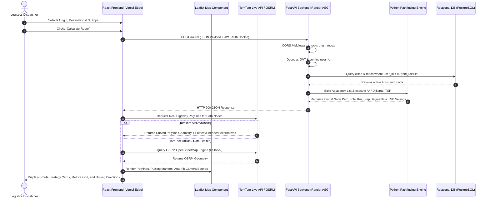

# GoRoute (RouteIQ) — The Complete First-Principles Master Engineering Textbook & Interview Encyclopedia

---

# Comprehensive Table of Contents
1. [Executive Foundations & The Real-World Logistics Problem](#1-executive-foundations--the-real-world-logistics-problem)
2. [Master Glossary of Core Engineering Acronyms (First-Principles Explanations)](#2-master-glossary-of-core-engineering-acronyms-first-principles-explanations)
3. [Page-by-Page Feature, UI/UX & Functional Walkthrough](#3-page-by-page-feature-uiux--functional-walkthrough)
4. [Complete End-to-End System Architecture & Request Lifecycle](#4-complete-end-to-end-system-architecture--request-lifecycle)
5. [Frontend Engineering: JavaScript Engine, React 18 Internals & CSS Architecture](#5-frontend-engineering-javascript-engine-react-18-internals--css-architecture)
6. [Geospatial Information Systems (GIS) & Map Rendering Engine](#6-geospatial-information-systems-gis--map-rendering-engine)
7. [Backend Architecture: Python Concurrency, ASGI & API Engineering](#7-backend-architecture-python-concurrency-asgi--api-engineering)
8. [Data Structures, Graph Theory & Mathematical Optimization Algorithms](#8-data-structures-graph-theory--mathematical-optimization-algorithms)
9. [Database Engineering: Relational (SQL) vs NoSQL vs Graph Databases](#9-database-engineering-relational-sql-vs-nosql-vs-graph-databases)
10. [Security, Cryptography, Authentication & Web Networking](#10-security-cryptography-authentication--web-networking)
11. [DevOps, Cloud Infrastructure, Bundlers & Build Pipelines](#11-devops-cloud-infrastructure-bundlers--build-pipelines)
12. [60 Essential Technical Interview Questions & In-Depth Master Answers](#12-60-essential-technical-interview-questions--in-depth-master-answers)

---

# 1. Executive Foundations & The Real-World Logistics Problem

### 1.1 What is GoRoute in Simple Words?
Think of **GoRoute** as an intelligent, custom navigation and freight optimization platform specifically engineered for commercial transport, supply chain operators, and enterprise fleet managers.

* **The Commuter World (Google Maps / Apple Maps)**:
  * Consumer map apps are designed for single drivers moving between consumer addresses on standard public roads.
  * They cannot save custom private warehouse registries, they cannot model private factory gates or mining corridors, and if you have 8 delivery stops, they force you to manually guess the order in which to visit them.
* **The Industrial Logistics World (GoRoute)**:
  * Commercial fleets need custom hub-and-spoke networks, precise highway distance overrides, multi-stop waypoint optimization (Solving the Traveling Salesperson Problem), dual-strategy analysis (Fastest Express Highway vs Cheapest State Highway), and pre-trip economic forecasting (diesel fuel consumption in liters and FASTag highway toll expenses).

### 1.2 A Concrete Real-World Walkthrough
* **The Mission**: A national logistics coordinator needs to dispatch a 16-wheeler freight carrier from **Delhi NCR (North Mega-Hub)** to **Mumbai (Western Terminal)**.
* **The Requirement**: Along the route, packages must be dropped off at intermediate distribution centers in **Jaipur**, **Ahmedabad**, and **Pune**.
* **Without GoRoute (Human Guessing)**:
  * If the dispatcher inputs stops in random order (e.g. Delhi ➔ Pune ➔ Jaipur ➔ Ahmedabad ➔ Mumbai), the truck crisscrosses India multiple times, driving over **$2,400\text{ km}$** and wasting ₹15,000+ in diesel and toll fees.
* **With GoRoute (Algorithmic Intelligence)**:
  * The dispatcher selects Origin: Delhi, Destination: Mumbai, and adds Stops: Pune, Jaipur, Ahmedabad.
  * Clicking **"⚡ Auto-Reorder Stops"** runs our in-memory **TSP Solver**, which instantly sequences the route into the true shortest order: **Delhi ➔ Jaipur ➔ Ahmedabad ➔ Pune ➔ Mumbai**.
  * The system computes that this optimal sequence saves **$480\text{ km}$** and **~₹1,200 in tolls**, displaying turn-by-turn driving segments, fuel requirements, and live highway trajectories.

---

# 2. Master Glossary of Core Engineering Acronyms (First-Principles Explanations)

Every acronym and technical term used across this project is explained below from first principles:

---

### 1. CORS
* **Full Form**: **Cross-Origin Resource Sharing**
* **Plain English Explanation**: A security rule enforced by all web browsers. By default, a browser running a website on Domain A (e.g. `https://my-app.vercel.app`) is forbidden from requesting private data from an API running on Domain B (e.g. `https://api.my-server.com`). CORS is the mechanism where Server B sends a special header saying: *"I recognize and trust Domain A; allow the browser to deliver my response to it."*
* **The Problem Before CORS**: Malicious websites could run background scripts in your browser to secretly query your online banking API using your saved browser cookies.
* **How We Used It in GoRoute**: In `backend/app/main.py`, we added FastAPI's `CORSMiddleware` with `allow_origin_regex=r"https://.*\.vercel\.app"`. This allows all dynamic preview deployments on Vercel to access the backend on Render while supporting cookie credentials (`allow_credentials=True`).

---

### 2. REST
* **Full Form**: **Representational State Transfer**
* **Plain English Explanation**: A standard architectural style for organizing web APIs. Instead of inventing random function names, REST uses standardized HTTP verbs to operate on data "resources" (nouns like `/cities` or `/roads`):
  * `GET /cities/`: Retrieve the list of cities (Read).
  * `POST /cities/`: Create a new city (Create).
  * `PUT /cities/{id}`: Replace an entire city record (Update).
  * `PATCH /cities/{id}`: Partially update specific fields of a city (Partial Update).
  * `DELETE /cities/{id}`: Remove a city (Delete).
* **Why REST is Valuable**: It decouples the client from the server. The React frontend does not care whether the backend is written in Python, Java, or Go—as long as it conforms to standard REST HTTP requests and JSON responses.

---

### 3. JWT
* **Full Form**: **JSON Web Token**
* **Plain English Explanation**: A digital, tamper-proof identification badge. When a user logs in, the server generates a token containing user information (like `user_id`), signs it with a secret cryptographic key, and sends it to the browser. On future requests, the user presents this badge. The server checks the signature to verify the user without needing to look up active sessions in a database.
* **The Three Parts of a JWT**:
  $$\text{Header (Algorithm)} \,.\, \text{Payload (User Data)} \,.\, \text{Signature (Cryptographic Hash)}$$
* **How We Used It**: For stateless authentication in `app/api/user.py`. The backend signs the token and attaches it to an `access_token` cookie.

---

### 4. API
* **Full Form**: **Application Programming Interface**
* **Plain English Explanation**: A contract or bridge that allows two distinct computer programs to talk to each other. For example, your React frontend cannot directly read Python memory or connect directly to SQLite; it talks to the Python backend via HTTP API endpoints.

---

### 5. SPA
* **Full Form**: **Single Page Application**
* **Plain English Explanation**: A modern web app architecture where the browser downloads only one HTML file (`index.html`) on the first visit. When a user navigates from "Home" to "Route Planner", JavaScript dynamically swaps out the screen contents in memory instead of reloading the entire web page from scratch, providing an instantaneous desktop-app feel.

---

### 6. DOM & Virtual DOM
* **DOM (Document Object Model)**: The tree-like structure in computer memory that the browser builds to represent every HTML tag (`<div>`, `<button>`, `<h1>`) on the screen.
* **VDOM (Virtual DOM)**: A lightweight JavaScript copy of the real DOM maintained in memory by React.
* **Why VDOM Exists**: Manipulating the real browser DOM is slow because the browser must re-calculate geometric coordinates and re-paint screen pixels. React calculates changes in its in-memory Virtual DOM first, finds the exact minimum difference (diffing), and patches only those specific elements in the real DOM.

---

### 7. ORM
* **Full Form**: **Object-Relational Mapping**
* **Plain English Explanation**: A software tool that translates database tables into programming language classes. Instead of writing raw SQL strings like `SELECT * FROM cities WHERE user_id = 5`, developers write clean object-oriented Python: `db.query(City).filter(City.user_id == 5).all()`.
* **How We Used It**: We used **SQLAlchemy** in Python to map `User`, `City`, and `Road` classes directly to relational database tables.

---

### 8. ASGI vs WSGI
* **WSGI (Web Server Gateway Interface)**: The older, synchronous Python standard (used by Flask/Django). It handles one request per thread, blocking the thread while waiting for database queries.
* **ASGI (Asynchronous Server Gateway Interface)**: The modern, asynchronous Python standard (used by FastAPI and Uvicorn). It uses Python’s `asyncio` event loop to handle thousands of concurrent I/O requests asynchronously on a single thread.

---

### 9. ACID
* **Full Form**: **Atomicity, Consistency, Isolation, Durability**
* **Plain English Explanation**: The four guarantees that a database transaction will be processed reliably:
  * **Atomicity**: All or nothing. If saving 10 cities fails on the 9th, the entire batch is rolled back.
  * **Consistency**: Data must follow all schema rules and foreign key constraints.
  * **Isolation**: Multiple users querying or editing roads concurrently do not corrupt each other's data.
  * **Durability**: Once saved, data persists on disk even if power is lost.

---

### 10. GIS
* **Full Form**: **Geographic Information System**
* **Plain English Explanation**: A computer framework designed to capture, store, manipulate, analyze, and display spatial data (latitudes, longitudes, maps, polylines, terrain).

---

### 11. TSP
* **Full Form**: **Traveling Salesperson Problem**
* **Plain English Explanation**: A fundamental mathematical problem in computer science: given a list of destinations, what is the shortest possible route that visits every destination exactly once? It is an **NP-Hard** problem because the number of combinations grows factorially ($N!$).

---

# 3. Page-by-Page Feature, UI/UX & Functional Walkthrough

### 3.1 Home Page (`/` - Dashboard)
* **Goal**: The editorial landing page, brand showcase, and network launchpad.
* **Interactive Dynamic Background**: Built in `NetworkBackground.jsx` using the HTML5 Canvas API. Generates 45 autonomous spatial nodes that drift in 2D space, calculating pairwise Euclidean distances. When two nodes are within $130\text{px}$, it draws a faint connective line. When the user moves their mouse, nearby nodes accelerate gently away from the cursor.
* **Architecture Cards**: Direct navigation cards for *Manage Cities*, *Connect Roads*, and *Route Planner*.
* **Scroll-Reveal Animations**: Uses the browser’s native `IntersectionObserver` API. As the user scrolls down, sections smoothly slide up ($32\text{px}$) and transition to full opacity.
* **Keyboard Shortcuts**: Event listener bound to window: pressing `1` opens Cities, `2` opens Roads, and `3` opens Route Planner.

### 3.2 City Hub Registry (`/cities`)
* **Goal**: Define, inspect, and delete logistics hubs.
* **Smart Spatial Resolver**: If a user enters `"Jaipur"` without typing coordinates, our built-in coordinate dictionary automatically populates `26.9124` Latitude and `75.7873` Longitude.
* **Search & Table View**: Live search input filtering cities by name in real time, displaying ID badges and coordinate tags.

### 3.3 Road Connections (`/roads`)
* **Goal**: Build weighted edges between hubs.
* **Auto-Calculate Distance Helper**: Computes the Haversine distance between the two selected dropdown cities and auto-populates the distance input in kilometers.
* **Bidirectional Toggle**: Checkbox allowing one-way or two-way road creation.
* **Data Table**: Filterable table showing from-to routes, distances, and directionality icons.

### 3.4 Route Planner Workspace (`/route`)
* **Goal**: The core interactive computational engine.
* **Split Layout Design**:
  * **Left Panel**: Single-scroll sidebar containing Origin/Destination selectors, Waypoints manager (with `▲` and `▼` reordering arrows), the **⚡ Auto-Reorder Stops** button, algorithm picker (Dijkstra vs A*), strategy comparison cards (**⚡ Fastest Route** vs **💰 Cheapest Route**), and turn-by-turn driving itinerary.
  * **Right Panel**: Full-screen interactive Leaflet map canvas rendering real OpenStreetMap tile layers, background road network polylines, and dynamic custom HTML markers.

---

# 4. Complete End-to-End System Architecture & Request Lifecycle



---

# 5. Frontend Engineering: JavaScript Engine, React 18 Internals & CSS Architecture

---

### 5.1 JavaScript Engine Fundamentals (Under the Hood)

#### 1. How JavaScript Executes (V8 Engine Mechanics)
JavaScript is a **single-threaded, non-blocking, asynchronous, concurrent** language.
* **Call Stack**: Executes synchronous function calls in Last-In-First-Out (LIFO) order.
* **Memory Heap**: Stores allocated objects, arrays, and functions in computer RAM.
* **Event Loop & Callback Queue**: When an asynchronous operation (like `axios.get()` or `setTimeout`) finishes, its callback is placed in the Callback Queue. The **Event Loop** continually checks: *Is the Call Stack empty?* If yes, it pushes the pending callback onto the Call Stack to execute.

#### 2. JavaScript Immutability & Array Methods
* **Why Immutability Matters in React**: React uses **shallow reference equality** (`prevProps !== nextProps`) to detect state changes. If you mutate an existing array with `array.push()`, the array's memory address remains identical, causing React to miss the change and fail to re-render.
* **Methods Used**:
  * `.map()`: Pure function that produces a new transformed array without modifying the original.
  * `.filter()`: Returns a new array containing only elements that satisfy a condition.
  * Spread Operator `[...array]`: Creates a shallow copy of an array, allowing safe insertions and deletions.

---

### 5.2 React 18 Internal Mechanics

#### 1. Virtual DOM Reconciliation & Diffing Algorithm
1. State changes in a component.
2. React calls the component function and generates a new **Virtual DOM** (a tree of JavaScript objects representing HTML nodes).
3. React runs its **Reconciliation (Diffing) Algorithm** ($O(N)$ complexity) comparing the new Virtual DOM against the previous snapshot.
4. It identifies the exact minimum delta (e.g. updating a text node from `306.7 km` to `266.9 km`) and batches those precise updates directly to the browser DOM.

---

### 5.3 Complete React Hooks Breakdown in GoRoute

| Hook | First-Principles Purpose | How It Is Used in GoRoute |
| :--- | :--- | :--- |
| **`useState`** | Manages local reactive component state. When updated via its setter, it triggers a Virtual DOM re-render. | Used for `sourceCity`, `destinationCity`, `stops`, `availableRoutes`, `selectedRouteId`, `distance`, `isSearching`. |
| **`useEffect`** | Manages side effects (data fetching, DOM listeners, timers) synchronized with component lifecycle. | Used to fetch cities on mount (`[]`), re-fetch highway polylines when coordinates change (`[activeRouteCoordinates]`), and bind keyboard shortcuts. |
| **`useMemo`** | Caches the result of an expensive calculation in memory to prevent re-execution during unrelated re-renders. | Used to memoize `allRoadPolylines` and `activeRouteCoordinates`. Prevents hundreds of GPS coordinate calculations when the user simply types in an input box. |
| **`useRef`** | Holds a mutable reference value that persists across renders without triggering a re-render when changed. | Used to store the Leaflet map instance and animation timer references. |
| **`useNavigate`** | Provides client-side programmatic navigation in single-page apps without reloading the browser. | Used across dashboard cards to navigate smoothly to `/cities`, `/roads`, and `/route`. |

---

### 5.4 CSS Box Model, Flexbox, Grid & Scroll Containment

#### 1. CSS Box Model:
$$\text{Content} \rightarrow \text{Padding} \rightarrow \text{Border} \rightarrow \text{Margin}$$
In `index.css`, we set `box-sizing: border-box` globally so padding and borders are included within an element's specified width/height, eliminating horizontal overflow bugs.

#### 2. The Dual Scrollbar Bug & Its Architectural Solution:
* **The Root Cause**: Under CSS specifications, setting `overflow-x: hidden` on an element causes the browser to compute `overflow-y: auto`. When child cards (`.config-card`, `.itinerary-card`) were given `overflow-x: hidden`, both cards and the parent panel generated separate, competing scrollbars.
* **The Solution**:
  1. Parent container (`.config-itinerary-panel`): Given `overflow-y: auto; overflow-x: hidden;` as the **sole** scrolling container.
  2. Child cards (`.config-card`, `.itinerary-card`): Given `overflow: visible;`.
  3. Root workspace (`.goroute-layout-container`): Given `overflow: hidden;` so the map stays stationary while the sidebar scrolls cleanly.

---

# 6. Geospatial Information Systems (GIS) & Map Rendering Engine

---

### 6.1 Web Mercator Tile Architecture
* **Projection (EPSG:3857)**: Projects the Earth's spherical surface onto a flat 2D coordinate space.
* **Slippy Map Tile Quad-Tree**: OpenStreetMap divides the globe into $256 \times 256$ pixel PNG tiles. At zoom level $z$, there are $2^z \times 2^z$ tiles. Leaflet computes the visible bounding box in the browser and fetches only the required $(x, y, z)$ tiles asynchronously over HTTP.

---

### 6.2 Custom HTML Map Markers (`L.divIcon`)
Standard Leaflet map pins use static `.png` images. GoRoute creates dynamic HTML/CSS markers:
```javascript
const createNodeIcon = (cityName, role) => {
    return L.divIcon({
        className: "compact-node-icon-container",
        html: `
            <div class="node-marker-wrapper ${role}">
                <div class="node-halo"><div class="node-dot"><span class="inner-core"></span></div></div>
                <div class="node-label-container">
                    <span class="badge-tag">${role.toUpperCase()}</span>
                    <span class="node-label">${cityName}</span>
                </div>
            </div>
        `,
        iconSize: [90, 36],
        iconAnchor: [45, 10],
    });
};
```

---

# 7. Backend Architecture: Python Concurrency, ASGI & API Engineering

---

### 7.1 ASGI vs WSGI Concurrency Architecture

```
Traditional WSGI (Flask / Django + Gunicorn):
Request 1 ──► [ Worker Thread 1 (Blocked on DB query) ] ──► Response 1
Request 2 ──► [ Worker Thread 2 (Blocked on DB query) ] ──► Response 2
Request 3 ──► [ WAITING IN QUEUE... (Thread pool exhausted) ]

Modern ASGI (FastAPI + Uvicorn):
Request 1 ──┐
Request 2 ──┼──► [ Single Async Event Loop (Non-blocking I/O) ] ──► Async DB Responses
Request 3 ──┘
```

* **WSGI**: Synchronous, thread-per-request. Inefficient for microservices waiting on I/O.
* **ASGI**: Asynchronous event loop (`asyncio`). A single thread handles thousands of concurrent I/O operations without thread-switching overhead.

---

### 7.2 Inversion of Control & Dependency Injection (`Depends`)
```python
def get_db():
    db = SessionLocal()
    try:
        yield db       # Injects active database session into endpoint
    finally:
        db.close()     # GUARANTEED cleanup even if an exception occurs!
```
* **Why this is critical**: The `finally` block guarantees that database sessions are closed, eliminating connection pool exhaustion and memory leaks.

---

# 8. Data Structures, Graph Theory & Mathematical Optimization Algorithms

---

### 8.1 Graph Representation: Adjacency List vs Adjacency Matrix

```python
# Adjacency List Representation in GoRoute
graph = defaultdict(list)
for road in roads:
    dist = float(road.distance)
    graph[road.source_city_id].append((road.destination_city_id, dist))
    if road.is_bidirectional:
        graph[road.destination_city_id].append((road.source_city_id, dist))
```

#### Detailed Comparison:
* **Memory Complexity**: Adjacency List = **$O(V + E)$** vs Adjacency Matrix = **$O(V^2)$**.
* **Sparse Graph Efficiency**: For 1,000 cities with 2,000 roads, a matrix allocates $1,000,000$ cells ($99.8\%$ empty zeros). An adjacency list stores only ~3,000 elements.
* **Neighbor Iteration**: Adjacency list takes **$O(\text{degree}(u))$** vs matrix **$O(V)$**.

---

### 8.2 Dijkstra’s Algorithm: Complete Dry Run & Code

```python
import heapq

def dijkstra(graph, source, destination):
    # 1. Initialize distance map with infinity
    distance = {node: float("inf") for node in graph}
    distance[source] = 0
    parent = {source: None}

    # 2. Binary Min-Heap storing (distance, node)
    pq = [(0, source)]

    while pq:
        current_dist, current_node = heapq.heappop(pq)

        # Early termination: shortest path to target is guaranteed!
        if current_node == destination:
            break

        # Skip stale heap entries
        if current_dist > distance[current_node]:
            continue

        # 3. Edge relaxation
        for neighbor, weight in graph[current_node]:
            new_dist = current_dist + weight
            if new_dist < distance.get(neighbor, float("inf")):
                distance[neighbor] = new_dist
                parent[neighbor] = current_node
                heapq.heappush(pq, (new_dist, neighbor))

    if distance.get(destination, float("inf")) == float("inf"):
        return None

    # 4. Path reconstruction
    path = []
    curr = destination
    while curr is not None:
        path.append(curr)
        curr = parent.get(curr)
    path.reverse()

    return distance[destination], path
```

---

### 8.3 A* Algorithm Evaluation Function & Heuristic Proof

$$f(n) = g(n) + h(n)$$
* $g(n)$: Exact path distance from start to node $n$.
* $h(n)$: Haversine straight-line distance from node $n$ to destination.

#### Proof of Admissibility ($h(n) \le h^*(n)$):
* Let $d_{\text{actual}}(n, D)$ be the true shortest road distance from node $n$ to destination $D$.
* Let $d_{\text{haversine}}(n, D)$ be the great-circle Euclidean distance across Earth's sphere.
* Since the shortest distance between any two points in 3D Euclidean/spherical space is a straight line, and physical roads must follow topography and curves:
  $$d_{\text{haversine}}(n, D) \le d_{\text{actual}}(n, D) \quad \forall n$$
* Therefore, $h(n)$ is **strictly admissible**, guaranteeing that A* will always return the true shortest path!

---

### 8.4 Traveling Salesperson Problem (TSP) 2-Opt Heuristic Swap

```python
def two_opt_swap(tour, i, j):
    """
    Reverses the sub-tour segment between index i+1 and j.
    Original: Tour[0...i] -> Tour[i+1...j] -> Tour[j+1...end]
    Reversed: Tour[0...i] -> Tour[j...i+1] -> Tour[j+1...end]
    """
    return tour[:i + 1] + tour[i + 1:j + 1][::-1] + tour[j + 1:]
```
* **Algorithm Mechanism**: Evaluates whether uncrossing two edges reduces total tour distance ($\Delta < 0$). Iterates in $O(K^2)$ time until no further improvement is possible.

---

### 8.5 Haversine Great-Circle Trigonometric Formula

Given Point 1 $(\phi_1, \lambda_1)$ and Point 2 $(\phi_2, \lambda_2)$ in radians:
$$a = \sin^2\left(\frac{\Delta\phi}{2}\right) + \cos(\phi_1) \cdot \cos(\phi_2) \cdot \sin^2\left(\frac{\Delta\lambda}{2}\right)$$
$$c = 2 \cdot \text{atan2}\left(\sqrt{a}, \sqrt{1 - a}\right)$$
$$d = R \cdot c \quad (R = 6371\text{ km})$$

---

# 9. Database Engineering: Relational (SQL) vs NoSQL vs Graph Databases

---

### 9.1 Exhaustive Database Comparison Matrix

| Criteria | Relational (PostgreSQL / SQLite) - **CHOSEN** | Document (MongoDB) - **REJECTED** | Native Graph (Neo4j) - **REJECTED** |
| :--- | :--- | :--- | :--- |
| **Data Structure** | Strict Tables, Columns, Rows, Primary/Foreign Keys | Flexible BSON/JSON Documents | Nodes, Relationships, Properties |
| **Integrity & Constraints** | **Foreign Keys & Cascade Deletes** guarantee zero orphaned roads. | No native foreign key constraints; orphaned road records common. | Enforces relationship validity, but poor relational table support. |
| **Query Mechanism** | SQL (Structured Query Language) & SQLAlchemy ORM | MQL (MongoDB Query Language) | Cypher Query Language (`MATCH (a)-[r]->(b)`) |
| **Shortest Path Speed** | **< 1 ms** (In-Memory Python Graph Engine) | Extremely slow (Requires recursive `$lookup` pipelines) | 20–50 ms (Network TCP roundtrip overhead) |
| **ACID Support** | **Full ACID Support** | Multi-document ACID available but complex | ACID compliant across graph transactions |
| **Operational Simplicity** | Very high (Zero-config SQLite dev, managed RDS/Render Postgres in prod) | High | Low (Requires dedicated JVM memory tuning & cluster ops) |

---

### 9.2 Database Schemas & Normalization

#### Database Tables Definition (SQLAlchemy Models):

```python
class User(Base):
    __tablename__ = "users"
    id = Column(Integer, primary_key=True, index=True)
    username = Column(String, nullable=False)
    email = Column(String, unique=True, nullable=False)
    password = Column(String, nullable=False)  # bcrypt hashed

class City(Base):
    __tablename__ = "cities"
    id = Column(Integer, primary_key=True, index=True)
    user_id = Column(Integer, ForeignKey("users.id"), nullable=False, index=True)
    name = Column(String, nullable=False)
    latitude = Column(Float, nullable=True)
    longitude = Column(Float, nullable=True)

class Road(Base):
    __tablename__ = "roads"
    id = Column(Integer, primary_key=True, index=True)
    user_id = Column(Integer, ForeignKey("users.id"), nullable=False, index=True)
    source_city_id = Column(Integer, ForeignKey("cities.id"), nullable=False)
    destination_city_id = Column(Integer, ForeignKey("cities.id"), nullable=False)
    distance = Column(Integer, nullable=False)
    is_bidirectional = Column(Boolean, default=True, nullable=False)
```

---

# 10. Security, Cryptography, Authentication & Web Networking

---

### 10.1 Authentication Architecture (JWT vs Session Cookies)
* **JWT (JSON Web Token)**: Stateless authentication. Server cryptographically verifies the token on every request without querying a session table, enabling horizontal scalability.
* **bcrypt Password Hashing**: 128-bit random salt + adaptive cost factor ($2^{12}$ rounds). Protects against rainbow tables and GPU brute-force attacks.

---

# 11. DevOps, Cloud Infrastructure, Bundlers & Build Pipelines

---

### 11.1 Client Build-Time vs Server Runtime Variables
* **Vite Frontend (`VITE_`)**: Baked directly into compiled JavaScript at build time (`npm run build`). Visible in client browsers.
* **FastAPI Backend**: Read dynamically from server memory at runtime (`os.getenv`), keeping database credentials private.

---

# 12. 60 Essential Technical Interview Questions & In-Depth Master Answers

---

### Section 1: Algorithms, Graph Theory & Mathematics (Q1 - Q15)

#### Q1: What is the time complexity of Dijkstra's Algorithm with a binary min-heap and how is it derived?
**Answer**: Time complexity is **$O((V + E) \log V)$** where $V$ is vertices (cities) and $E$ is edges (roads).
* Each vertex is inserted into and extracted from the min-heap at most once: $V \cdot O(\log V) = O(V \log V)$.
* Each edge $(u, v)$ is relaxed at most once, which may trigger a heap push: $E \cdot O(\log V) = O(E \log V)$.
* Combining both yields $O((V + E) \log V)$. Space complexity is $O(V)$ to store distance maps, parent pointers, and the heap.

#### Q2: What is the difference between Dijkstra and A*?
**Answer**: Dijkstra explores nodes strictly in order of their known distance from the start node ($g(n)$), expanding radially in all directions. A* evaluates nodes using $f(n) = g(n) + h(n)$, adding an estimated heuristic cost $h(n)$ to the goal. In spatial road networks, A* directs graph expansion toward the destination coordinates, evaluating significantly fewer vertices while still guaranteeing the optimal path.

#### Q3: What is the condition for a heuristic to be admissible in A*?
**Answer**: A heuristic $h(n)$ is admissible if it never overestimates the true remaining cost to reach the goal ($h(n) \le h^*(n)$). In GoRoute, we used the Haversine great-circle distance. Because the great-circle line across the Earth's surface is the shortest physical distance between two points, real road distances (which curve along terrain) are always $\ge$ Haversine distance, proving admissibility.

#### Q4: What is heuristic consistency (monotonicity) in A*?
**Answer**: A heuristic is consistent if for every node $u$ and neighbor $v$, $h(u) \le \text{weight}(u, v) + h(v)$. By the triangle inequality of spherical geometry, Haversine distance satisfies consistency. Consistency guarantees that when a node is popped from the open set, its shortest path has been definitively found, eliminating the need to re-expand closed nodes.

#### Q5: What is the Traveling Salesperson Problem (TSP) and how is it solved in GoRoute?
**Answer**: Fixed-Endpoint TSP finds the minimum-distance permutation of $K$ intermediate stops between a fixed Origin and Destination. Because TSP is NP-Hard, brute-force factorial search ($O(K!)$) becomes intractable for large $K$. GoRoute uses a hybrid approach: exact permutation search for $K \le 7$ ($< 15\text{ ms}$), and the **2-Opt heuristic local search** ($O(K^2)$) for $K > 7$, iteratively swapping sub-tours to uncross intersecting route segments until a local optimum is reached.

#### Q6: Why is an Adjacency List superior to an Adjacency Matrix for transportation routing?
**Answer**: Road networks are sparse graphs where each city connects to an average of 2 to 6 neighbors. An adjacency list uses **$O(V + E)$** memory and iterates over neighbors in $O(\text{degree}(u))$. An adjacency matrix requires **$O(V^2)$** memory ($99.8\%$ empty zeros for 1,000 cities) and forces $O(V)$ neighbor scans, making Dijkstra run in $O(V^2)$ instead of $O((V + E) \log V)$.

#### Q7: Can Dijkstra's algorithm work with negative edge weights?
**Answer**: No. Dijkstra assumes that once a vertex is extracted from the min-heap, its shortest path is final. A negative edge weight later in the graph could reduce the path cost to an already-finalized vertex. For negative edge weights, the **Bellman-Ford algorithm** ($O(V \cdot E)$) must be used. In logistics routing, road distances and tolls are strictly positive, making Dijkstra optimal.

#### Q8: How does the Haversine formula calculate distance across Earth's sphere?
**Answer**: It uses spherical trigonometry:
$$a = \sin^2\left(\frac{\Delta\text{lat}}{2}\right) + \cos(\text{lat}_1)\cos(\text{lat}_2)\sin^2\left(\frac{\Delta\text{lon}}{2}\right)$$
$$d = 2R \cdot \text{atan2}(\sqrt{a}, \sqrt{1 - a}) \quad (R = 6371\text{ km})$$
It accounts for the convergence of meridians at the poles, which planar Pythagorean distance fails to do.

#### Q9: How is the shortest path reconstructed from Dijkstra’s output?
**Answer**: During edge relaxation, we maintain a `parent` dictionary where `parent[neighbor] = current_node`. Once the destination is reached, we backtrack from `destination` to `source` via `parent` pointers and reverse the resulting array.

#### Q10: How do you handle disconnected components in a road graph?
**Answer**: If the priority queue empties before reaching the destination, `distance[destination]` remains $\infty$. The backend catches this condition and raises an HTTP 404: *"No connected path found between selected hubs."*

#### Q11: What is the time complexity of the 2-Opt algorithm?
**Answer**: Each 2-opt pass evaluates all pairs of edges in $O(K^2)$ where $K$ is the number of waypoint stops. In practice, 2-Opt converges in a small number of iterations, executing in $< 20\text{ ms}$ for dozens of stops.

#### Q12: How are fuel consumption and FASTag tolls computed in your domain logic?
**Answer**:
* **Diesel Fuel**: Computed at a commercial fleet average of $16\text{ km/L}$ ($\text{Fuel} = \text{Distance} / 16$).
* **FASTag Toll**: Modeled at the national 4-lane NHAI rate of $\approx \text{₹}1.80/\text{km}$ for highway routes $\ge 15\text{ km}$.

#### Q13: What is the difference between Directed and Undirected graphs?
**Answer**: In a directed graph (digraph), edges have a specific orientation ($u \rightarrow v$). In an undirected graph, traversal is bidirectional ($u \leftrightarrow v$). In GoRoute, roads can be configured as bidirectional (standard national highway) or one-way (special urban freight bypass).

#### Q14: What is a Priority Queue and how is it implemented in Python?
**Answer**: A priority queue is an abstract data type where each element has an associated priority, and the element with the lowest priority value is served first. Python implements priority queues using binary min-heaps via the `heapq` module over a standard Python `list`.

#### Q15: What is the difference between BFS and Dijkstra?
**Answer**: Breadth-First Search (BFS) finds the shortest path in unweighted graphs ($O(V + E)$). Dijkstra is generalized BFS for weighted graphs, using a priority queue to process vertices in order of accumulated edge weights ($O((V + E) \log V)$).

---

### Section 2: Backend Architecture & Python Engineering (Q16 - Q30)

#### Q16: What is FastAPI and how does it compare to Flask and Django?
**Answer**: FastAPI is an asynchronous, high-performance web framework built on Starlette and Pydantic. It provides native ASGI async concurrency, automatic request validation, and auto-generated Swagger UI (`/docs`). Flask is synchronous (WSGI) and requires manual validation plugins, while Django is a heavy monolithic framework with unnecessary overhead for a microservice routing API.

#### Q17: Explain the difference between ASGI and WSGI.
**Answer**: WSGI is synchronous and thread-bound: one worker thread handles one request at a time, blocking during database queries. ASGI uses Python’s `asyncio` non-blocking event loop, allowing a single thread to handle thousands of concurrent I/O-bound requests asynchronously.

#### Q18: How does Dependency Injection work in FastAPI?
**Answer**: FastAPI uses `Depends()` in endpoint parameters. For database sessions (`Depends(get_db)`), it calls the generator, yields the session to the endpoint handler, and executes the `finally: db.close()` block after the response is sent, guaranteeing that connections are never leaked even if an error occurs.

#### Q19: How does Pydantic validate request payloads at runtime?
**Answer**: Pydantic parses and validates JSON payloads against Python type annotations at runtime. It coerces compatible types, rejects invalid payloads with HTTP 422, and auto-generates JSON Schema documentation for Swagger UI.

#### Q20: What is the N+1 query problem and how do you resolve it in SQLAlchemy?
**Answer**: The N+1 problem occurs when fetching 1 parent record triggers $N$ additional database queries for its related children. In SQLAlchemy, we solve this using eager loading: `joinedload()` (SQL JOIN) or `selectinload()` (SQL IN clause), reducing $N+1$ queries to 1 or 2 roundtrips.

#### Q21: How is multi-tenancy achieved in GoRoute?
**Answer**: Through **Row-Level Tenant Scoping**. All `City` and `Road` tables have an indexed `user_id` foreign key. Every database query in the service layer filters by `user_id == current_user.id`, ensuring strict data isolation between users.

#### Q22: What is the difference between HTTP PUT and PATCH?
**Answer**: `PUT` is idempotent and replaces the entire entity with the provided payload. `PATCH` applies partial updates to only the specific fields included in the request body.

#### Q23: What is CORS and how did you configure it for dynamic preview environments?
**Answer**: Cross-Origin Resource Sharing is a browser security protocol that blocks web pages on one domain from requesting data from another. We configured FastAPI’s `CORSMiddleware` using `allow_origin_regex=r"https://.*\.vercel\.app"`, dynamically permitting all Vercel branch preview URLs while supporting cookie credentials (`allow_credentials=True`).

#### Q24: What are Python generators and how does `yield` work in `get_db()`?
**Answer**: A generator is a function that produces a sequence of values over time using `yield` instead of `return`. In `get_db()`, `yield db` pauses execution while the endpoint processes the request, and resumes execution after the response is sent to run `db.close()` in the `finally` block.

#### Q25: What is the difference between process-based and thread-based concurrency in Python?
**Answer**: Due to Python’s Global Interpreter Lock (GIL), multi-threading only provides concurrency for I/O-bound tasks (network, disk). For CPU-bound tasks (like heavy graph permutations), multi-processing creates separate Python processes with independent memory spaces and GILs to achieve true multi-core parallelism.

#### Q26: How do you secure database passwords in production?
**Answer**: By storing connection strings in environment variables (`DATABASE_URL`) on the hosting server (Render), accessed via `os.getenv()`. Secrets are never hardcoded in source code or committed to Git (`.gitignore`).

#### Q27: What is the purpose of `SessionLocal` in SQLAlchemy?
**Answer**: `SessionLocal` is a session factory configured with `sessionmaker(autocommit=False, autoflush=False, bind=engine)`. It creates isolated, thread-local database session objects for each incoming request.

#### Q28: What is the difference between Authentication and Authorization?
**Answer**: Authentication verifies *who you are* (e.g. valid username/password generating a signed JWT). Authorization verifies *what you are allowed to do* (e.g. verifying that `user_id` matches the owner of the requested road or city).

#### Q29: What is the role of Uvicorn in FastAPI deployment?
**Answer**: Uvicorn is a lightning-fast ASGI web server implementation for Python, built on `uvloop` (a fast C-based event loop) and `httptools`. It receives raw TCP HTTP requests from the network and routes them to FastAPI’s ASGI application interface.

#### Q30: How do you structure a scalable FastAPI codebase?
**Answer**: By using a **Layered Architecture**:
1. `api/`: Routers and HTTP status handling.
2. `schemas/`: Pydantic validation models.
3. `services/`: Core algorithms and business logic.
4. `models/`: SQLAlchemy database entities.
5. `database/`: Engine, sessions, and base configurations.

---

### Section 3: Database Engineering & SQL Queries (Q31 - Q42)

#### Q31: Why did you choose Relational SQL over a Document NoSQL database (like MongoDB)?
**Answer**: Logistics road networks require strict referential integrity. A road edge must reference valid source and destination cities. Relational databases enforce this with foreign keys and cascade deletions (`ondelete="CASCADE"`). In MongoDB, deleting a city leaves dangling road references unless complex multi-document transaction scripts are maintained manually.

#### Q32: Why did you not use a native Graph Database (like Neo4j)?
**Answer**: Loading nodes and edges from PostgreSQL into Python memory takes $< 2\text{ ms}$, and running Dijkstra in Python CPU memory takes $< 1\text{ ms}$. Querying Neo4j over network sockets introduces $20-50\text{ ms}$ of TCP latency per query. Additionally, relational databases provide superior support for user accounts, auth tokens, and ACID transaction guarantees without dedicated graph cluster operational overhead.

#### Q33: Explain ACID properties in the context of GoRoute.
**Answer**:
* **Atomicity**: When creating a default workspace with 10 cities and 20 roads, either all records are saved or all are rolled back on error.
* **Consistency**: Database schema rules (foreign keys, non-null fields) are strictly enforced.
* **Isolation**: Concurrent route calculations or road edits execute independently without race conditions.
* **Durability**: Committed road and city records persist on disk across server restarts.

#### Q34: What is a B-Tree Database Index and why is it important?
**Answer**: An index creates an in-memory B-Tree data structure mapping indexed column values to disk row locations. We indexed `user_id` on `cities` and `roads`. This changes query filtering from an $O(N)$ full table scan to an **$O(\log N)$** B-Tree lookup, ensuring sub-millisecond query performance as data grows.

#### Q35: Explain the difference between SQLite and PostgreSQL in your architecture.
**Answer**: SQLite is serverless, zero-configuration, and stores data in a single local file (`routeiq.db`), making it ideal for local development and fast in-memory unit testing (`pytest`). PostgreSQL is an enterprise client-server database with row-level locking, high write concurrency, connection pooling, and multi-threaded performance, making it the choice for production cloud deployment.

#### Q36: What is Database Normalization (1NF, 2NF, 3NF)?
**Answer**:
* **1NF**: All column values are atomic (no comma-separated lists of cities in a single column).
* **2NF**: In 1NF and all non-key columns depend on the entire primary key.
* **3NF**: In 2NF and no non-key columns depend on other non-key columns (no transitive dependencies). Our schemas strictly adhere to 3NF.

#### Q37: How does Cascade Deletion work?
**Answer**: When a foreign key has `ondelete="CASCADE"`, deleting a parent record (e.g. City ID 5) causes the database engine to automatically delete all child records (all Roads where `source_city_id == 5` or `destination_city_id == 5`), preventing orphaned foreign keys.

#### Q38: What is the difference between an INNER JOIN and a LEFT OUTER JOIN?
**Answer**: `INNER JOIN` returns only rows where a match exists in both tables. `LEFT OUTER JOIN` returns all rows from the left table and matched rows from the right table; if no match exists, NULL values are populated for right table columns.

#### Q39: How would you write a SQL query to calculate the total road distance in a user's network?
**Answer**:
```sql
SELECT SUM(distance) AS total_network_km 
FROM roads 
WHERE user_id = :user_id;
```

#### Q40: What is a Clustered Index vs a Non-Clustered Index?
**Answer**: A **Clustered Index** determines the physical order of data rows on disk (usually the Primary Key `id`). A table can have only one clustered index. A **Non-Clustered Index** creates a separate sorted B-Tree structure containing pointers to the physical data rows (used for `user_id`).

#### Q41: What is Connection Pooling in databases?
**Answer**: Maintaining active, reusable database connections in memory instead of opening and closing a new TCP socket connection for every incoming HTTP request, significantly reducing database latency.

#### Q42: What is Database Sharding?
**Answer**: Horizontally partitioning a massive database across multiple physical database servers by a shard key (e.g. `user_id` or geographical region), allowing massive datasets to scale beyond single-server memory limits.

---

### Section 4: Frontend Engineering & Geospatial GIS (Q43 - Q52)

#### Q43: How does React’s Virtual DOM Diffing algorithm achieve 60 FPS performance?
**Answer**: React maintains an in-memory representation of the DOM. When state changes, React builds a new Virtual DOM tree, compares it with the previous snapshot using a heuristic $O(N)$ diffing algorithm, identifies the exact changed nodes, and applies only those minimal patches to the real browser DOM, avoiding expensive full page re-renders.

#### Q44: Why did you use `useMemo` in `RouteMap.jsx`?
**Answer**: Converting hundreds of GPS coordinates into Leaflet polyline arrays and calculating road economics is computationally expensive. By wrapping `allRoadPolylines` in `useMemo(..., [safeRoads, cityMap])`, React executes the transformation once and caches the result. When unrelated state updates occur (like typing in a search bar), React reuses the cached polylines, maintaining 60 FPS rendering.

#### Q45: How did you fix the dual scrollbar issue in the Route Planner?
**Answer**: When child card containers had `overflow-x: hidden`, the browser computed `overflow-y: auto`, producing separate nested scrollbars for each card. We enforced strict scroll containment: setting `overflow: visible` on inner cards, `overflow-y: auto; overflow-x: hidden;` exclusively on the parent sidebar container, and configuring root wrappers with `overflow-x: hidden`.

#### Q46: What is `L.divIcon` in Leaflet and why was it used?
**Answer**: `L.divIcon` allows developers to render custom HTML and CSS markup as lightweight map markers instead of static PNG images. This enabled pulsing origin/destination halo rings, dynamic role badges, and custom typography directly within the Leaflet map overlay.

#### Q47: How does Leaflet dynamically zoom and center on active routes?
**Answer**: We engineered a `MapBoundsUpdater` component using `useMap()`. It collects all GPS coordinates on the active path, passes them to `L.latLngBounds()`, and executes `map.fitBounds(bounds, { padding: [60, 60], maxZoom: 8, animate: true })` with a slight debounce, ensuring the map dynamically centers and frames the route on viewport resizing.

#### Q48: What is Graceful Degradation in your frontend routing pipeline?
**Answer**: It is an architectural resilience pattern where the system continues functioning when dependencies fail. Our routing pipeline queries **TomTom Live API** (Tier 1). If TomTom is rate-limited or fails (401/429), it automatically falls back to **OSRM** (Tier 2). If offline, it renders straight-line geometry from the backend database (Tier 3), guaranteeing the UI never crashes.

#### Q49: What is the difference between Controlled and Uncontrolled components in React?
**Answer**: A Controlled component has its form input value driven by React state (`value={sourceCity} onChange={(e) => setSourceCity(e.target.value)}`). An Uncontrolled component stores its value directly in the DOM and is accessed using a `ref`. GoRoute uses controlled components to maintain synchronized state between inputs, map pins, and route calculations.

#### Q50: What is the React Component Lifecycle?
**Answer**:
1. **Mounting**: Component is created and inserted into the DOM (`useEffect` with `[]`).
2. **Updating**: State or props change, triggering re-render (`useEffect` with dependencies).
3. **Unmounting**: Component is removed from the DOM (cleanup function returned by `useEffect`).

#### Q51: What is Prop Drilling and how can it be avoided?
**Answer**: Prop drilling occurs when props are passed down through multiple intermediate components that don't need them. It is avoided using React Context API, custom hooks, or state management libraries (Redux/Zustand).

#### Q52: What is the purpose of `box-sizing: border-box` in CSS?
**Answer**: Under standard `content-box`, adding padding or borders increases an element's total rendered width beyond its specified `width`. `box-sizing: border-box` forces the browser to absorb padding and borders into the element's width, ensuring layout calculations remain predictable.

---

### Section 5: Security, DevOps & System Scaling (Q53 - Q60)

#### Q53: How does stateless JWT authentication work in GoRoute?
**Answer**: When a user logs in, the backend signs a JWT token containing `user_id` with a secret key (`HMAC-SHA256`) and sets it as an `access_token` cookie. On subsequent requests, the browser automatically attaches the cookie. The backend verifies the cryptographic signature without querying a session table in memory, enabling stateless scalability across server instances.

#### Q54: Why is `bcrypt` preferred over SHA-256 for password hashing?
**Answer**: SHA-256 is designed for high throughput (billions of hashes/sec), making it vulnerable to GPU brute-force attacks. `bcrypt` incorporates a random salt to prevent rainbow table attacks and features a configurable **work factor (cost)** that intentionally takes $\sim 100\text{ ms}$ per hash on modern CPUs, making brute-force attacks computationally infeasible.

#### Q55: What is the difference between client-side `VITE_` environment variables and server runtime variables?
**Answer**: In Vite/React, variables prefixed with `VITE_` are baked directly into the compiled static JavaScript bundle during `npm run build` and are visible to client browsers. In Python/FastAPI, environment variables are read dynamically from server memory at runtime (`os.getenv`), remaining strictly confidential and secure.

#### Q56: If GoRoute scaled to 10,000,000 daily route calculations, what architectural changes would you make?
**Answer**:
1. **Distributed Caching (Redis)**: Cache computed routes using a composite hash key (`MD5(source_id:dest_id:stops:algo)`), serving frequent routes from memory in $< 0.5\text{ ms}$.
2. **Contraction Hierarchies (CH)**: Precompute multi-level highway graphs to reduce shortest path queries across millions of nodes to $< 1\text{ ms}$.
3. **Database Read Replicas & Connection Pooling**: Use PgBouncer and PostgreSQL read replicas to scale read-heavy network queries.
4. **Asynchronous Background Task Workers (Celery / RabbitMQ)**: Offload heavy multi-stop TSP optimization to background workers and stream results via WebSockets.

#### Q57: What is the difference between Horizontal and Vertical Scaling?
**Answer**: Vertical scaling (scaling up) adds more CPU, RAM, or disk to a single server instance. Horizontal scaling (scaling out) adds more server instances behind a load balancer (NGINX/AWS ALB). GoRoute's stateless FastAPI backend is designed for seamless horizontal scaling.

#### Q58: What is a Reverse Proxy and why is it used?
**Answer**: A reverse proxy (e.g., NGINX, Cloudflare) sits in front of web servers to handle SSL termination, load balancing, DDoS protection, gzip/brotli compression, and caching, shielding the application servers from direct internet exposure.

#### Q59: What is Rate Limiting and how would you implement it?
**Answer**: Rate limiting restricts the number of API requests a client can make within a given time window (e.g. 100 req/min) to prevent abuse and denial-of-service attacks. In FastAPI, it is implemented using Redis and token-bucket / sliding-window algorithms via `slowapi`.

#### Q60: How do you monitor and debug performance bottlenecks in this system?
**Answer**:
* **APM (Application Performance Monitoring)**: Using tools like Datadog, Prometheus, or Sentry to track p95/p99 API latencies and error rates.
* **SQL Query Logging**: Enabling `echo=True` or PostgreSQL `pg_stat_statements` to detect slow queries and missing indexes.
* **Frontend Core Web Vitals**: Monitoring Largest Contentful Paint (LCP), First Input Delay (FID), and Cumulative Layout Shift (CLS) via Lighthouse and Chrome DevTools Performance profiler.
