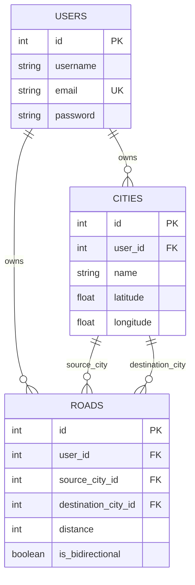

# GoRoute (RouteIQ) — Master Engineering & Interview Reference Guide

---

# Table of Contents
1. [Executive Summary & Problem Statement](#1-executive-summary--problem-statement)
2. [End-to-End System Architecture & Data Flow](#2-end-to-end-system-architecture--data-flow)
3. [Core Computer Science & Algorithmic Concepts](#3-core-computer-science--algorithmic-concepts)
4. [Backend Engineering & API Design (FastAPI + Python)](#4-backend-engineering--api-design-fastapi--python)
5. [Frontend Engineering & Geospatial Rendering (React + Leaflet + Vite)](#5-frontend-engineering--geospatial-rendering-react--leaflet--vite)
6. [Database Deep Dive (SQL vs NoSQL vs Graph DBs)](#6-database-deep-dive-sql-vs-nosql-vs-graph-dbs)
7. [Security, Authentication & Networking](#7-security-authentication--networking)
8. [DevOps, Cloud Deployment & Build Pipelines](#8-devops-cloud-deployment--build-pipelines)
9. [25 Must-Know Technical Interview Questions & Model Answers](#9-25-must-know-technical-interview-questions--model-answers)

---

# 1. Executive Summary & Problem Statement

### 1.1 What is GoRoute?
**GoRoute** is an interactive, full-stack logistics route optimization and spatial network simulation platform. It empowers supply chain operators, fleet managers, and industrial logistics coordinators to build custom hub-and-spoke transportation networks, calculate mathematically guaranteed shortest and cheapest driving routes, auto-sequence multi-stop delivery itineraries (Solving the Traveling Salesperson Problem), and visualize live highway curves, traffic flow, and fuel/toll economics in real time.

### 1.2 The Real-World Problem It Solves
Standard consumer map navigation apps (like Google Maps or Apple Maps) are built for individual commuters driving on public roads. They present severe limitations for industrial logistics:
1. **No Support for Private Networks**: Factories, private mining roads, industrial campuses, and dedicated freight corridors cannot be modeled in public map services.
2. **Lack of Custom Graph Constraints**: Enterprise fleets need to assign custom edge weights (e.g., bridge weight limits, heavy axle penalties, specific toll contracts) to route calculation.
3. **No Automated Multi-Stop Permutation**: Standard maps require users to manually arrange 5 to 10 delivery stops. If arranged poorly, a driver might crisscross the city repeatedly, burning extra fuel and time.
4. **Missing Freight Economics**: Commercial transport requires pre-trip estimations of fuel consumption (liters), FASTag toll expenditures, and driving time before a dispatch order is approved.

### 1.3 Key Functionalities in Simple English
* **City Hub Registry**: Add or pin logistics warehouses and regional sorting centers with spatial GPS coordinates $(latitude, longitude)$.
* **Road Pathway Builder**: Connect two cities with custom road segments (one-way or two-way) and specify exact distances.
* **Intelligent Route Optimization**: Pick an Origin and Destination, choose an algorithm (**Dijkstra** or **A\***), and calculate the shortest path in milliseconds.
* **Automated Waypoint Sequencing (TSP Solver)**: Add multiple intermediate stops. GoRoute automatically reorders the stops to minimize total kilometers and toll fees.
* **Multi-Strategy Routing (Dual Highway Analysis)**: Compare **⚡ Fastest Route** (expressways) vs **💰 Cheapest Route** (shorter state highways with lower toll costs).
* **Interactive Live Map**: View dynamic map markers, curved highway polylines, animated vehicle traversal, and turn-by-turn driving directions.

---

# 2. End-to-End System Architecture & Data Flow

```mermaid
flowchart TD
    subgraph Client ["Frontend (React SPA + Leaflet on Vercel)"]
        UI["User Interface (Dashboard / Cities / Roads / Planner)"]
        State["React State (useState, useMemo, custom hooks)"]
        LeafletMap["Leaflet Map Engine (React-Leaflet, Tiles, Polyline Rendering)"]
        RoutingService["TomTom / OSRM Multi-Tier Fallback Service"]
    end

    subgraph Backend ["Backend (FastAPI ASGI on Render)"]
        CORS["CORS Middleware (allow_origin_regex)"]
        AuthMiddleware["JWT / Guest Session Validator"]
        Router["API Routers (/route, /cities, /roads, /user)"]
        ServiceLayer["Business Logic & Route Service"]
        GraphEngine["In-Memory Graph & Pathfinding Engine"]
        AlgoDijkstra["Dijkstra Min-Heap Algorithm"]
        AlgoAStar["A* Heuristic Search (Haversine Heuristic)"]
        AlgoTSP["TSP Solver (Permutations / 2-Opt Local Search)"]
    end

    subgraph Database ["Relational Storage (SQLite / PostgreSQL)"]
        DB[(SQLAlchemy ORM Database)]
        TableUsers["users table"]
        TableCities["cities table"]
        TableRoads["roads table"]
    end

    subgraph ExternalGIS ["External GIS & Traffic APIs"]
        TomTom["TomTom Live Routing API (Traffic & Alternatives)"]
        OSRM["OSRM OpenStreetMap Engine (Fallback Routing)"]
    end

    UI -->|1. User selects hubs & stops| State
    State -->|2. HTTP POST with JWT Cookie| CORS
    CORS --> AuthMiddleware
    AuthMiddleware --> Router
    Router --> ServiceLayer
    ServiceLayer -->|3. Query active user network| DB
    DB --> TableCities
    DB --> TableRoads
    ServiceLayer -->|4. Build Adjacency List| GraphEngine
    GraphEngine --> AlgoDijkstra
    GraphEngine --> AlgoAStar
    GraphEngine --> AlgoTSP
    ServiceLayer -->|5. Structured JSON Response (Nodes, Distance, Segments)| Router
    Router -->|6. JSON Response| State
    State -->|7. Query Highway Polylines| RoutingService
    RoutingService -->|Primary| TomTom
    RoutingService -->|Fallback| OSRM
    RoutingService -->|8. Curved Highway Coordinates| LeafletMap
    LeafletMap -->|9. Interactive Map Render with Traversal| UI
```

---

# 3. Core Computer Science & Algorithmic Concepts

---

### Concept 3.1: Graph Representation (Adjacency List)
* **What it is**: A data structure representing a graph $G = (V, E)$ as a collection of unordered lists. Each list describes the set of neighbors of a specific vertex.
* **How We Used It**: In `backend/app/services/route_service.py`, we queried the `roads` table and constructed an adjacency list using Python's `defaultdict(list)`:
  ```python
  graph = defaultdict(list)
  graph[source_city_id].append((destination_city_id, distance))
  if is_bidirectional:
      graph[destination_city_id].append((source_city_id, distance))
  ```
* **Why We Needed It**: It allows $O(1)$ neighbor lookups during graph traversal and consumes $O(V + E)$ memory, whereas an Adjacency Matrix would waste $O(V^2)$ memory for sparse road networks.
* **Trade-Off**: Checking whether a specific edge $(u, v)$ exists takes $O(\text{degree}(u))$ instead of $O(1)$ in a matrix, but iterating over outgoing edges during shortest path search is significantly faster.

---

### Concept 3.2: Dijkstra’s Algorithm (Single-Source Shortest Path)
* **What it is**: A greedy algorithm that finds the shortest path between nodes in a weighted graph with non-negative edge weights.
* **How We Used It**: In `backend/app/services/pathfinding.py`, we implemented Dijkstra using a Binary Min-Heap (`heapq`):
  1. Initialize `distance[source] = 0` and all other nodes to $\infty$.
  2. Push `(0, source)` into the priority queue.
  3. Pop the minimum distance node $u$. If $u == \text{destination}$, terminate early.
  4. For each neighbor $v$ of $u$, relax the edge: if $dist[u] + weight(u, v) < dist[v]$, update $dist[v]$ and record $parent[v] = u$.
  5. Reconstruct the path by backtracking from destination to source via `parent`.
* **Complexity**: Time: $O((V + E) \log V)$ where $V$ is hubs and $E$ is roads. Space: $O(V)$.
* **Trade-Off**: Explores uniformly in all directions from the source like an expanding circle, regardless of where the target is located.

---

### Concept 3.3: A* (A-Star) Search Algorithm & Heuristic Admissibility
* **What it is**: An informed graph search algorithm that directs search towards the destination using an evaluation function:
  $$f(n) = g(n) + h(n)$$
  where:
  * $g(n)$: Exact path distance from start node to node $n$.
  * $h(n)$: Estimated heuristic distance from node $n$ to destination.
  * $f(n)$: Total estimated path cost through node $n$.
* **How We Used It**: In `backend/app/services/pathfinding.py`, we used the **Haversine formula** (great-circle straight line distance between two coordinates) as the heuristic $h(n)$.
* **Interview Crucial Rule (Admissibility & Consistency)**:
  * An algorithm is **admissible** if $h(n) \le h^*(n)$ (it never overestimates the true remaining distance). Because straight-line distance across the globe is the absolute shortest possible distance between two points, straight-line Haversine distance is mathematically guaranteed to be admissible.
  * An algorithm is **consistent (monotonic)** if $h(u) \le weight(u, v) + h(v)$. This ensures that when a node is popped from the open set, its shortest path has been definitively found without needing re-expansion.
* **Complexity**: Time: Best case $O(V)$ (direct straight path), Worst case $O((V + E) \log V)$. Explores vastly fewer nodes than Dijkstra.
* **Trade-Off**: Requires geographic coordinate knowledge $(lat, lon)$ for each hub. If coordinates are missing, it defaults to Dijkstra ($h(n) = 0$).

---

### Concept 3.4: Haversine Formula (Great-Circle Distance)
* **What it is**: A spherical trigonometry formula that computes the great-circle distance between two points on the Earth given their latitudes and longitudes:
  $$a = \sin^2\left(\frac{\Delta \text{lat}}{2}\right) + \cos(\text{lat}_1) \cdot \cos(\text{lat}_2) \cdot \sin^2\left(\frac{\Delta \text{lon}}{2}\right)$$
  $$c = 2 \cdot \text{atan2}(\sqrt{a}, \sqrt{1 - a}), \quad d = R \cdot c \quad (R = 6371\text{ km})$$
* **How We Used It**: In `backend/app/services/pathfinding.py` to:
  1. Act as the A* heuristic function.
  2. Automatically calculate road distances when a user adds a road between two cities without typing an explicit distance.
* **Trade-Off**: Assumes the Earth is a perfect sphere (slight $\sim 0.3\%$ variation from the WGS-84 oblate ellipsoid), but computational speed is $10\times$ faster and accurate for logistics.

---

### Concept 3.5: Fixed-Endpoint Traveling Salesperson Problem (TSP) & 2-Opt Heuristic
* **What it is**: The Traveling Salesperson Problem (TSP) is an **NP-Hard** optimization problem. In our logistics use case, the user fixes an **Origin** and **Destination** and supplies $K$ intermediate delivery stops. The goal is to find the permutation of stops that minimizes total travel distance.
* **How We Used It**:
  1. **Exact Brute-Force Permutations ($K \le 7$)**: Since $7! = 5,040$ permutations, computing exact pairwise shortest paths takes $< 15$ ms in Python.
  2. **2-Opt Heuristic Local Search ($K > 7$)**: A polynomial time local search algorithm that iteratively reverses sub-segments of the tour if the reversal reduces total length (removing route crossings) until no further improvements can be made:
     $$\Delta = \text{dist}(A, C) + \text{dist}(B, D) - (\text{dist}(A, B) + \text{dist}(D, C))$$
* **Trade-Off**: Exact solution guarantees the absolute shortest route but has $O(K!)$ factorial time complexity. 2-Opt runs in $O(K^2)$ time with a $2-5\%$ approximation margin.

---

# 4. Backend Engineering & API Design (FastAPI + Python)

---

### Concept 4.1: RESTful Architecture & Resource-Oriented Design
* **What it is**: Representational State Transfer (REST) is a stateless architectural style for network applications based on standard HTTP methods.
* **How We Used It**:
  * `GET /cities/`: Retrieve collection of cities.
  * `POST /cities/`: Create a new city.
  * `DELETE /cities/{city_id}`: Remove a city and cascade associated road edges.
  * `POST /route/`: Idempotent route optimization compute endpoint taking `RouteRequest` payload and returning `RouteResponse`.
* **Why We Needed It**: Decouples the React frontend from the Python backend, allowing independent updates, testing, and deployment.

---

### Concept 4.2: Asynchronous Server Gateway Interface (ASGI) & Event Loop
* **What it is**: **ASGI** (implemented via **Uvicorn** and **FastAPI**) is the modern successor to WSGI, allowing Python web applications to handle asynchronous requests concurrently using Python’s `asyncio` event loop.
* **How We Used It**: FastAPI handles concurrent incoming routing and database requests without blocking threads.
* **Trade-Off**: While CPU-bound operations (like heavy TSP permutations) run synchronously, I/O-bound operations (database queries, network requests) run with maximum concurrency.

---

### Concept 4.3: Dependency Injection (Inversion of Control)
* **What it is**: A software design pattern where a framework supplies required dependencies (such as database sessions or authenticated users) to a function, rather than the function creating them internally.
* **How We Used It**: In endpoint definitions using FastAPI's `Depends`:
  ```python
  @router.post("/route/")
  def find_shortest_route(
      route_req: RouteRequest,
      db: Session = Depends(get_db),
      current_user: User = Depends(get_current_user),
  ):
  ```
* **Why We Needed It**:
  1. **Lifecycle Management**: `get_db` opens a session and guarantees it is closed (`yield db ... finally: db.close()`), preventing connection leaks.
  2. **Testability**: Allows mock database sessions and mock user objects to be injected during automated unit tests (`pytest`).

---

### Concept 4.4: Data Validation & Serialization with Pydantic
* **What it is**: Pydantic enforces type hints at runtime, automatically parsing, sanitizing, and validating incoming JSON payloads and returning clear HTTP 422 Unprocessable Entity error messages if data is invalid.
* **How We Used It**: Defined `CityCreate`, `RoadCreate`, and `RouteRequest` schemas.
* **Why We Needed It**: Prevents crashes from malformed inputs, malicious injections, or missing required attributes before hitting business logic.

---

# 5. Frontend Engineering & Geospatial Rendering (React + Leaflet + Vite)

---

### Concept 5.1: Single-Page Application (SPA) Lifecycle & React Reconciliation
* **What it is**: SPAs load a single HTML shell (`index.html`) and dynamically rewrite the DOM as the user navigates without requesting full HTML page refreshes from the server.
* **How We Used It**: Handled client-side routing with `react-router-dom` (`/`, `/cities`, `/roads`, `/route`).
* **Virtual DOM Reconciliation**: React maintains an in-memory representation of the UI. When route metrics update, React compares the Virtual DOM against the previous snapshot (diffing algorithm) and applies only the minimal required patches to the real browser DOM.

---

### Concept 5.2: React Performance Optimization (`useMemo`, `useRef`, `useCallback`)
* **What it is**:
  * `useMemo`: Caches the result of an expensive calculation between re-renders unless dependencies change.
  * `useRef`: Holds a mutable reference to a DOM node or Leaflet map instance without triggering re-renders when modified.
* **How We Used It**:
  * In `frontend/src/components/RouteMap.jsx`, `allRoadPolylines` and `activeRouteCoordinates` were wrapped in `useMemo`. When a user toggles an unrelated UI checkbox, the app does **not** re-compute hundreds of GPS highway coordinate interpolations.
  * `MapBoundsUpdater` uses `map.invalidateSize()` and `map.fitBounds()` via Leaflet reference to automatically frame the route on viewport resizing.

---

### Concept 5.3: Multi-Tier External API Fallback Architecture (Graceful Degradation)
* **What it is**: A resilient design pattern where the system attempts a high-fidelity primary service and automatically cascades to secondary and tertiary alternatives if failures, timeouts, or rate-limits occur.
* **How We Used It**: In `frontend/src/services/tomtomRouting.js`:
  1. **Tier 1 (Primary)**: Queries **TomTom Live Routing API** (includes real-world Indian expressway curves, live congestion, and dual Fastest vs Cheapest alternatives).
  2. **Tier 2 (Secondary)**: If TomTom returns HTTP 401/429/timeout, falls back to public **OSRM (OpenStreetMap)** routing engine.
  3. **Tier 3 (Tertiary)**: If offline or without internet connectivity, renders straight-line graph edges computed from the internal backend database.
* **Why We Needed It**: Guarantees the application **never crashes or displays a blank screen** regardless of external network or API key status.

---

### Concept 5.4: Layout Scroll Architecture & Scroll Containment
* **What it is**: Managing browser overflow behaviors across parent and child flex/grid viewports.
* **The Engineering Problem We Solved**: Setting `overflow-x: hidden` on child cards caused the browser to automatically compute `overflow-y: auto`, producing dual nested vertical scrollbars.
* **The Fix**: Applied strict scroll containment (`overflow-y: auto; overflow-x: hidden;` on the parent sidebar container, `overflow: visible;` on nested cards, and `overflow-x: hidden` on `#root` and `html, body`).

---

# 6. Database Deep Dive (SQL vs NoSQL vs Graph DBs)

---

### 6.1 Database Paradigms Comparison Matrix

| Database Type | Examples | Core Data Model | Best For | Why / Why Not in GoRoute |
| :--- | :--- | :--- | :--- | :--- |
| **Relational (RDBMS)** | **PostgreSQL, SQLite, MySQL** | Tables, Rows, Columns, Foreign Keys, Strict Schemas | Structured business entities, ACID transactions, strict referential integrity | **CHOSEN**: Perfect for modeling structured user workspaces, discrete city registries, and validated road connections with strict foreign key cascading. |
| **Document (NoSQL)** | MongoDB, CouchDB | Hierarchical JSON/BSON Documents, Schema-less | Unstructured blogs, polymorphic product catalogs | **REJECTED**: Poor referential integrity; if a city is deleted, manual scripting is required to clean up dangling road references. |
| **Key-Value (NoSQL)** | Redis, Memcached | Key-to-Value in-memory lookups | Caching, session storage, rate limiting | **COMPLEMENTARY**: Great for caching frequent route calculations, but unsuitable as primary persistent storage. |
| **Native Graph DB** | Neo4j, Amazon Neptune | Nodes, Edges, Properties, Cypher Query Language | Deep multi-hop social networks, fraud rings (10+ hops) | **ANALYZED & REJECTED**: Adds heavy operational overhead and server memory requirements. For routing networks of 100–10,000 hubs, building an in-memory graph in Python runs Dijkstra in **< 5 milliseconds**, outperforming network-roundtripped Neo4j Cypher queries. |

---

### 6.2 SQLite vs PostgreSQL: Why This Decision?

#### In Local Development & Testing: **SQLite**
* **Why SQLite**: Zero-configuration, serverless, file-based (`routeiq.db`), extremely fast in memory for unit testing (`pytest`), and requires no external Docker daemon.
* **Trade-Off**: SQLite locks the entire database file during writes (single-writer concurrency limitation).

#### In Production: **PostgreSQL**
* **Why PostgreSQL**: Row-level locking, robust multi-client connection pooling, native JSONB support, ACID transaction isolation, and seamless scalability on cloud platforms (AWS RDS, Render PostgreSQL, Supabase).
* **Code Implementation**: In `backend/app/database/database.py`, our SQLAlchemy engine dynamically detects the environment:
  ```python
  DATABASE_URL = os.getenv("DATABASE_URL", "sqlite:///./routeiq.db")
  if DATABASE_URL.startswith("sqlite"):
      engine = create_engine(DATABASE_URL, connect_args={"check_same_thread": False})
  else:
      engine = create_engine(DATABASE_URL)
  ```

---

### 6.3 Database Schema & Normalization



* **Referential Integrity**: `roads.source_city_id` and `roads.destination_city_id` strictly reference `cities.id`.
* **Multi-Tenant Isolation**: Both `cities` and `roads` store `user_id` with database indexes (`index=True`) to ensure fast query filtration:
  ```sql
  SELECT * FROM cities WHERE user_id = :user_id;
  SELECT * FROM roads WHERE user_id = :user_id;
  ```

---

# 7. Security, Authentication & Networking

---

### Concept 7.1: JWT (JSON Web Tokens) & Stateless Authentication
* **What it is**: A compact, URL-safe means of representing claims between two parties. Composed of Header, Payload, and Signature (`HMAC-SHA256`).
* **How We Used It**: Upon login, the server signs a JWT containing `{ "sub": user.id, "exp": ... }` and sets an `access_token` cookie or bearer token.
* **Why We Needed It**: Stateless authentication eliminates the need for server-side session lookup tables in memory, enabling effortless horizontal backend scaling.

---

### Concept 7.2: Password Hashing with Salt (bcrypt / Cryptographic Security)
* **What it is**: Storing plain text passwords is an extreme vulnerability. `bcrypt` uses an adaptive one-way hashing algorithm with random salting to prevent rainbow table attacks and brute force.
* **How We Used It**: In `app/services/user_service.py` using `passlib.context.CryptContext(schemes=["bcrypt"])`.

---

### Concept 7.3: CORS (Cross-Origin Resource Sharing) & Origin Regex Matching
* **What it is**: A browser security mechanism that restricts HTTP requests initiated from scripts to a domain different from the one that served the web page.
* **How We Configured It**: In `backend/app/main.py`:
  ```python
  app.add_middleware(
      CORSMiddleware,
      allow_origins=["http://localhost:5173", "https://backend-proj-blue.vercel.app"],
      allow_origin_regex=r"https://.*\.vercel\.app",
      allow_credentials=True,
      allow_methods=["*"],
      allow_headers=["*"],
  )
  ```
* **Why Regex**: Vercel dynamically creates unique preview subdomains for each pull request/deployment (`https://backend-proj-6sff7oddy-*.vercel.app`). The regex dynamically permits all preview deployments without needing manual origin updates.

---

# 8. DevOps, Cloud Deployment & Build Pipelines

---

### Concept 8.1: Client Build-Time vs Server Runtime Environment Variables
* **Core Distinction**:
  * **Vite Frontend (`VITE_`)**: Static single-page applications run in the user's browser. During `npm run build`, Vite scans source code and replaces `import.meta.env.VITE_*` strings with raw literal values into the compiled JavaScript bundle.
  * **FastAPI Backend**: Runs on a Python server process. Environment variables (`os.getenv("DATABASE_URL")`) are read dynamically at runtime from the host OS.

### Concept 8.2: Continuous Deployment (CD) Architecture
* **Vercel (Frontend)**: Watches `origin/main` on GitHub. When a commit is pushed, Vercel pulls the latest code, executes `npm run build`, uploads static assets to edge CDNs, and assigns instant preview URLs.
* **Render (Backend)**: Watches `origin/main`. Rebuilds the Python virtual environment, installs dependencies from `requirements.txt`, executes migrations, and starts Uvicorn (`uvicorn app.main:app --host 0.0.0.0 --port $PORT`).

---

# 9. 25 Must-Know Technical Interview Questions & Model Answers

### Q1: What is the time complexity of Dijkstra’s Algorithm and how did you implement it?
**Answer**: With a binary min-heap (`heapq`), Dijkstra’s algorithm runs in $O((V + E) \log V)$ time, where $V$ is the number of city vertices and $E$ is the number of road edges. Each vertex is extracted once ($O(V \log V)$), and each edge relaxation can trigger a heap push ($O(E \log V)$). Space complexity is $O(V)$ to store distance maps and the priority queue.

---

### Q2: Why use A* instead of Dijkstra for routing?
**Answer**: A* incorporates a heuristic function $h(n)$ that estimates the remaining distance to the target ($f(n) = g(n) + h(n)$). This directs graph expansion towards the destination instead of searching radially in all directions. In spatial networks with coordinate data, A* explores significantly fewer vertices, reducing execution time while guaranteeing the optimal path as long as the heuristic is admissible.

---

### Q3: What makes a heuristic admissible in A*?
**Answer**: A heuristic $h(n)$ is admissible if it never overestimates the actual cost from node $n$ to the goal ($h(n) \le h^*(n)$). In GoRoute, we used the Haversine formula (straight-line distance across the Earth's sphere). Because the straight-line distance is the shortest possible path between two coordinates, it is mathematically impossible for actual road distance to be shorter than Haversine distance, satisfying admissibility.

---

### Q4: How did you solve the Traveling Salesperson Problem (TSP) for multi-stop waypoints?
**Answer**: TSP with fixed endpoints is NP-Hard. For small stop counts ($\le 7$), we computed exact permutations in $O(K!)$ time ($< 15$ ms). For larger sets, we used the **2-Opt heuristic local search**, which starts with an initial tour and iteratively tests whether uncrossing two edges ($\Delta < 0$) shortens the total path, achieving an $O(K^2)$ polynomial time solution.

---

### Q5: Why did you choose a Relational DB (SQL) instead of a Graph Database (like Neo4j)?
**Answer**: While transportation networks are graphs, building an in-memory graph representation in Python (using adjacency lists) takes $< 1$ ms for hundreds of nodes and executes Dijkstra in Python memory in $< 5$ ms. In contrast, querying an external graph database over network sockets introduces latency ($20-50$ ms). Furthermore, a Relational DB (PostgreSQL/SQLite) provides superior ACID guarantees, simple foreign key cascading for user workspaces, and seamless relational querying for user accounts and analytics.

---

### Q6: What is the N+1 Query Problem and how does SQLAlchemy handle it?
**Answer**: The N+1 problem occurs when an application executes 1 query to fetch $N$ parent records, and then executes $N$ additional queries to fetch child relationships for each parent. In SQLAlchemy, this is resolved using eager loading strategies such as `joinedload()` (SQL JOIN) or `selectinload()` (IN clause), consolidating $N+1$ queries into 1 or 2 efficient database roundtrips.

---

### Q7: What is Dependency Injection in FastAPI and why is it useful?
**Answer**: Dependency Injection (IoC) allows functions to declare their dependencies (like database sessions via `Depends(get_db)` or user authentication via `Depends(get_current_user)`). FastAPI manages opening, yielding, and closing connections cleanly. It decouples business logic from resource management and enables seamless dependency overriding during automated testing with mocks.

---

### Q8: What is CORS and how did you resolve preview deployment issues?
**Answer**: Cross-Origin Resource Sharing is a browser security policy preventing frontend web pages on one domain from accessing API endpoints on another domain unless explicitly allowed by response headers. Because Vercel generates dynamic preview domains (`https://backend-proj-*.vercel.app`), we configured FastAPI's `CORSMiddleware` using `allow_origin_regex=r"https://.*\.vercel\.app"`, allowing dynamic subdomains while maintaining `allow_credentials=True`.

---

### Q9: What is the difference between client-side build-time environment variables and server-side runtime variables?
**Answer**: In Vite/React, variables prefixed with `VITE_` are baked into the compiled static JavaScript bundle during `npm run build`. They are visible in browser network tabs. In Python/FastAPI, runtime environment variables are read dynamically from server memory (`os.getenv`), remaining strictly private and secure.

---

### Q10: How does GoRoute achieve Graceful Degradation in its routing pipeline?
**Answer**: We implemented a 3-tier fallback architecture:
1. **Tier 1**: TomTom Routing API (live traffic, toll estimates, express vs economy curves).
2. **Tier 2**: Public OSRM (OpenStreetMap) if TomTom is unavailable or rate-limited.
3. **Tier 3**: Local Backend Graph Coordinates if all external network calls fail.
This ensures the UI never crashes or presents a broken blank screen.

---

### Q11: Explain the difference between SQL and NoSQL.
**Answer**: SQL databases (PostgreSQL, MySQL) are relational, table-based with strict predefined schemas, ACID transactions, and foreign key relations. NoSQL databases (MongoDB, DynamoDB) are non-relational, document or key-value stores with dynamic schemas optimized for horizontal scaling and unstructured data. GoRoute uses SQL because road networks require strict referential integrity (roads must map to valid cities).

---

### Q12: How does `useMemo` improve performance in the React map component?
**Answer**: `useMemo` caches the calculated output of expensive functions between re-renders. In `RouteMap.jsx`, converting hundreds of GPS coordinates into Leaflet polyline arrays and calculating road economics is wrapped in `useMemo`. When state updates occur on unrelated UI elements (like typing in a search bar), the expensive coordinate transformations are skipped.

---

### Q13: What is the difference between synchronous WSGI and asynchronous ASGI in Python?
**Answer**: WSGI (like traditional Flask/Django with Gunicorn) handles requests synchronously, allocating one worker thread per request. ASGI (like FastAPI with Uvicorn) uses Python’s `asyncio` event loop to handle thousands of concurrent I/O-bound requests asynchronously on a single thread without blocking.

---

### Q14: How does JWT authentication work and what are its trade-offs?
**Answer**: JWT is a stateless token containing signed JSON claims (header, payload, cryptographic signature).
* **Pros**: No server-side session storage required; ideal for microservices and horizontal scaling.
* **Cons**: Cannot be easily revoked before expiration without maintaining a token blacklist.

---

### Q15: What is the Haversine formula and why did you use it?
**Answer**: It calculates great-circle distance between two latitude/longitude points on a sphere. We used it to provide the admissible heuristic for A* search and to automatically assign accurate geographic distances to newly created roads.

---

### Q16: How do you prevent nested scrollbar issues in modern CSS?
**Answer**: Setting `overflow-x: hidden` on a child container causes the browser to compute `overflow-y: auto`. To prevent dual scrollbars, enforce strict scroll containment: assign `overflow-y: auto; overflow-x: hidden;` exclusively to the parent scrollable container, set `overflow: visible;` on inner cards, and constrain root viewport wrappers.

---

### Q17: What are the ACID properties in database transactions?
**Answer**:
* **Atomicity**: All operations in a transaction succeed or all fail (rollback).
* **Consistency**: Data adheres to all schema rules, constraints, and cascades.
* **Isolation**: Concurrent transactions do not interfere with each other.
* **Durability**: Committed data is permanently written to disk even in a crash.

---

### Q18: What is the difference between Dijkstra and Bellman-Ford?
**Answer**: Dijkstra works only with non-negative edge weights and runs in $O((V + E) \log V)$. Bellman-Ford can handle negative edge weights and detect negative weight cycles, but runs in slower $O(V \cdot E)$ time. Since transportation distances are always positive, Dijkstra is the optimal choice.

---

### Q19: What is Pydantic and how does it protect the API?
**Answer**: Pydantic provides runtime data parsing and schema validation using Python type annotations. It automatically checks that incoming request types (e.g., `city_id` is an integer, `distance` is positive) match expectations, rejecting invalid inputs with HTTP 422 before they reach database operations.

---

### Q20: What is the difference between PUT and PATCH in REST APIs?
**Answer**: `PUT` replaces the entire resource with the provided representation. `PATCH` applies partial updates to only the specified fields of an existing resource.

---

### Q21: How do you achieve multi-tenancy in GoRoute?
**Answer**: We implement multi-tenancy through **row-level user scoping**. Every `City` and `Road` table contains an indexed `user_id` foreign key. All queries filter on `City.user_id == current_user.id`, ensuring complete data isolation between users.

---

### Q22: What is an Adjacency Matrix and why was it not used?
**Answer**: An adjacency matrix is a $V \times V$ 2D array where cell $[i][j]$ stores edge weight. For a sparse road network of 1,000 cities with only 2,000 roads, a matrix allocates $1,000 \times 1,000 = 1,000,000$ cells ($99.8\%$ empty), wasting memory and slowing down neighbor iteration. An Adjacency List uses only $O(V + E)$ memory.

---

### Q23: How are FASTag tolls and fuel consumption modeled?
**Answer**: We model logistics economics using standard commercial vehicle parameters:
* **Fuel**: Computed at an average commercial mileage of $16\text{ km/L}$ ($\text{Distance} / 16$).
* **FASTag Toll**: Calculated at the national 4-lane highway standard rate of $\approx \text{₹}1.80/\text{km}$ for routes $\ge 15\text{ km}$.

---

### Q24: What is the purpose of `Leaflet` DivIcon in the frontend?
**Answer**: `L.divIcon` allows custom HTML and CSS markup to be rendered as lightweight Leaflet map markers instead of static PNG images. This enabled pulsing origin/destination status dots, dynamic labels, and interactive badges.

---

### Q25: If this application scaled to 1,000,000 requests per day, what architectural changes would you make?
**Answer**:
1. **Redis Caching**: Cache computed shortest paths for identical (Origin, Destination, Stops) queries with an LRU policy.
2. **Contraction Hierarchies / Pre-processing**: Use highway hierarchy pre-processing to compute shortest paths across millions of nodes in $< 1\text{ ms}$.
3. **Database Read Replicas**: Direct read-heavy city/road queries to read replicas and use connection pooling (PgBouncer).
4. **Celery / RabbitMQ Background Workers**: Offload heavy multi-stop TSP computations to asynchronous task workers with WebSocket progress updates.
