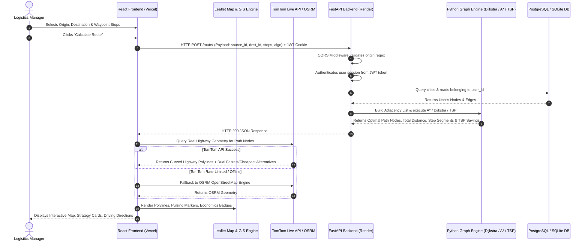
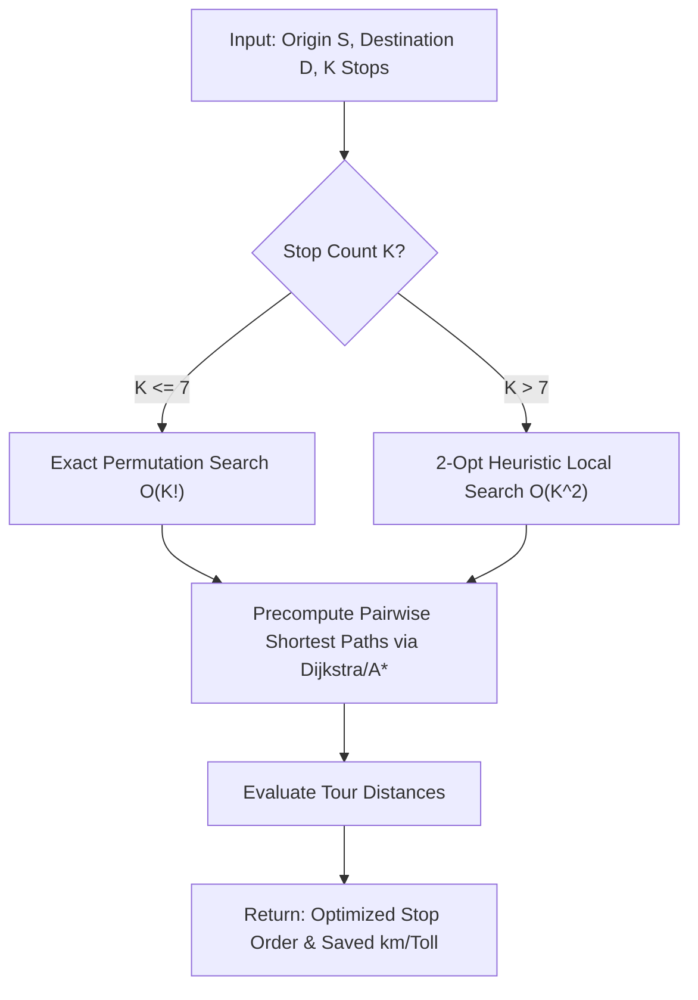
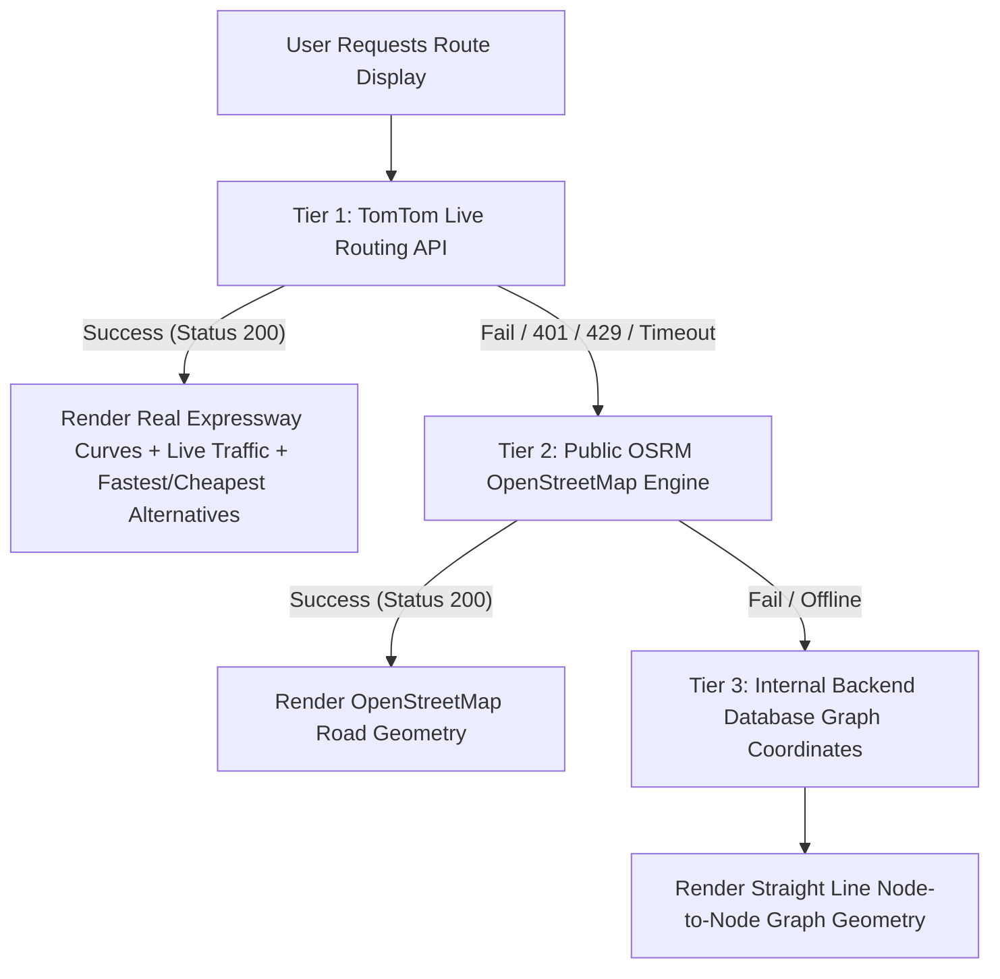

# GoRoute (RouteIQ) — The Ultimate Master Engineering & Interview Encyclopedia

---

# Table of Contents
1. [What is GoRoute? (The Big Picture in Simple English)](#1-what-is-goroute-the-big-picture-in-simple-english)
2. [End-to-End System Architecture & Request Lifecycle](#2-end-to-end-system-architecture--request-lifecycle)
3. [Page-by-Page Feature & UI/UX Breakdown](#3-page-by-page-feature--uiux-breakdown)
4. [Data Structures & Graph Algorithms Deep Dive](#4-data-structures--graph-algorithms-deep-dive)
5. [Backend Engineering & API Design (FastAPI + Python)](#5-backend-engineering--api-design-fastapi--python)
6. [Frontend Engineering & Geospatial Rendering (React + Leaflet + Vite)](#6-frontend-engineering--geospatial-rendering-react--leaflet--vite)
7. [Database Engineering: SQL vs NoSQL vs Graph Databases](#7-database-engineering-sql-vs-nosql-vs-graph-databases)
8. [Security, Authentication & Networking](#8-security-authentication--networking)
9. [DevOps, Cloud Infrastructure & Build Systems](#9-devops-cloud-infrastructure--build-systems)
10. [Top 40 Technical Interview Questions & In-Depth Model Answers](#10-top-40-technical-interview-questions--in-depth-model-answers)

---

# 1. What is GoRoute? (The Big Picture in Simple English)

### 1.1 The Concept in Simple Terms
Imagine you run a logistics company with 50 delivery trucks moving goods across the country every day.
* Standard consumer apps like **Google Maps** only let you search public roads one trip at a time. They cannot save your private company hubs, they cannot model private factory haul roads, and if you have 8 delivery stops, they force you to manually guess the best order to visit them.
* **GoRoute** is an enterprise-grade **custom logistics network builder and route intelligence platform**. 
* It allows you to:
  1. **Build Your Own Spatial Network**: Define custom distribution hubs, warehouses, and factories with GPS coordinates.
  2. **Connect Custom Roads**: Define the exact road links between your hubs, set custom distances, and mark whether roads are one-way or two-way.
  3. **Calculate Guaranteed Optimal Paths**: Using industry-standard shortest-path algorithms (**Dijkstra** and **A\***), find the shortest route between any two hubs in milliseconds.
  4. **Auto-Reorder Multiple Waypoints (TSP Solver)**: Give the app an Origin, a Destination, and 5 intermediate delivery stops in any random order. GoRoute automatically solves the **Traveling Salesperson Problem (TSP)** to find the mathematical shortest visiting order that saves kilometers, diesel fuel, and toll costs.
  5. **Analyze Highway Strategy (Fastest vs Cheapest)**: Compare express highways (fastest travel time) against state highways (lowest toll expenditure and shortest physical distance).
  6. **Predict Trip Logistics Economics**: Automatically compute driving time (hours & minutes), fuel consumption (diesel liters at commercial mileage), and FASTag highway toll expenses before a truck ever leaves the dispatch yard.

### 1.2 Real-World Use Case Walkthrough
Let's walk through an actual scenario:
* **The Scenario**: An e-commerce fleet manager needs to ship freight starting at **Delhi NCR (North Mega-Hub)** and delivering to the final destination **Mumbai (Western Terminal)**.
* **The Challenge**: Along the way, packages must be dropped off at three intermediate hubs: **Jaipur**, **Ahmedabad**, and **Pune**.
* **What Happens Without GoRoute**: If the driver visits them in the order entered (Delhi ➔ Pune ➔ Jaipur ➔ Ahmedabad ➔ Mumbai), they drive back and forth across western India, traveling over $2,400\text{ km}$ and wasting ₹15,000+ in extra diesel and toll fees.
* **What GoRoute Does**:
  1. The user selects Origin: Delhi, Destination: Mumbai, and adds Stops: Pune, Jaipur, Ahmedabad.
  2. The user clicks **"⚡ Auto-Reorder Stops"**.
  3. GoRoute's backend graph engine computes all permutations using spatial heuristics and reorders the stops to: **Delhi ➔ Jaipur ➔ Ahmedabad ➔ Pune ➔ Mumbai**.
  4. The platform displays the live map traversal, calculates that this reordering saves **$480\text{ km}$** and **~₹1,200 in tolls**, and outputs turn-by-turn driving segments with fuel and duration estimates.

---

# 2. End-to-End System Architecture & Request Lifecycle

### 2.1 The Complete Architectural Flow



---

# 3. Page-by-Page Feature & UI/UX Breakdown

### 3.1 Home Page (`/` - Dashboard)
* **Goal**: Editorial landing page and network command center.
* **Visual Experience**:
  * **Dynamic Graph Animation**: Built with HTML5 Canvas in `NetworkBackground.jsx`, rendering interactive floating nodes and connecting lines that pulse and react to cursor proximity.
  * **Hero Area**: Clear value proposition: *"Orchestrate Your Network — Build your custom distribution network, connect road corridors, and calculate the most cost-effective routes in milliseconds."*
  * **3 Core Architecture Cards**: Direct navigation to *Manage Cities*, *Connect Roads*, and *Route Planner*.
  * **Scroll-Reveal Animations**: Implemented using the browser's `IntersectionObserver` API to smoothly fade in benefit rows, timeline steps, and use cases as the user scrolls.
  * **Keyboard Shortcuts**: Global listener for `1` (Cities), `2` (Roads), and `3` (Route Planner).

### 3.2 City Hub Registry (`/cities`)
* **Goal**: Register and manage spatial hubs across the logistics network.
* **Key Features**:
  * Form to input City Name, Latitude, and Longitude.
  * **Automatic Spatial Centroid Resolver**: If the user enters a recognized city (e.g. "Jaipur", "Bengaluru") without coordinates, the app automatically fills the exact geographic latitude and longitude.
  * Real-time search filter to quickly search large hub registries.
  * Interactive table with coordinate badges and delete actions with confirmation.

### 3.3 Road Connections (`/roads`)
* **Goal**: Build physical and contractual highway links between registered hubs.
* **Key Features**:
  * Dropdowns populated with the user's active cities.
  * Distance field (in kilometers) with an **Auto-Calculate Distance** helper that calculates real-world Haversine distance between selected city coordinates.
  * **Bidirectional Highway Toggle**: Checkbox to designate whether travel is two-way (standard national highway) or one-way (special urban freight corridor or mountain bypass).
  * Filterable table showing source, destination, distance badges, and directionality indicators.

### 3.4 Route Planner Workspace (`/route`)
* **Goal**: The core computational workspace.
* **Layout**: Full-screen split layout:
  * **Left Sidebar (Single Contained Scroll)**:
    * Origin & Destination selectors with a instant **⇄ Swap Hubs** button.
    * Waypoint Stops list with **Move Up (`▲`)** and **Move Down (`▼`)** manual ordering buttons.
    * **⚡ Auto-Reorder Stops (Shortest Path)** button when 2+ stops are added.
    * Algorithm selector: **Dijkstra** (guaranteed shortest) vs **A\*** (heuristic guided).
    * Route & Trip Details card showing:
      * Stop Sequence Optimization Banner (e.g., *"Reordering intermediate stops saves 48.2 km & ~₹87 toll"*).
      * Multi-Strategy Driving Cards: **⚡ Fastest Route** vs **💰 Cheapest Route**.
      * Full Route Journey sequence chips with transit indicators.
      * Economics Metrics Grid: Total Distance, Driving Time, Fuel Needed (~Liters), and FASTag Toll Cost.
      * Step-by-Step Driving Directions with per-leg durations, tolls, and fuel.
  * **Right Map Canvas (100% Viewport)**:
    * Interactive Leaflet canvas rendering real OpenStreetMap tile layers.
    * Custom HTML/CSS `L.divIcon` markers with distinct styling for Origin (dark navy halo), Destination (pulsing green/red core), and Waypoints (amber badge).
    * Curved highway polyline showing the exact driving geometry.
    * Background dashed lines showing all registered roads in the user's network.
    * Auto-focusing `MapBoundsUpdater` that automatically animates the camera to frame all points on the active route.

---

# 4. Data Structures & Graph Algorithms Deep Dive

---

### 4.1 Graph Representation: Adjacency List vs Adjacency Matrix

#### Why Graphs?
A transportation network is inherently a mathematical graph $G = (V, E)$:
* $V$ (Vertices): The logistics hubs / cities.
* $E$ (Edges): The roads connecting pairs of hubs.
* $W$ (Weights): The distance or cost associated with traversing each road.

#### The Data Structure Choice: Adjacency List
In Python, we construct the graph as an adjacency list using `defaultdict(list)`:
```python
# graph[u] = [(v1, weight1), (v2, weight2), ...]
graph = defaultdict(list)
for road in roads:
    dist = float(road.distance)
    graph[road.source_city_id].append((road.destination_city_id, dist))
    if road.is_bidirectional:
        graph[road.destination_city_id].append((road.source_city_id, dist))
```

#### Comparison for Interview:

| Feature | Adjacency List (Used) | Adjacency Matrix (Rejected) |
| :--- | :--- | :--- |
| **Memory Complexity** | **$O(V + E)$** | **$O(V^2)$** |
| **Sparse Graph Efficiency** | Highly efficient. For 1,000 cities with 2,000 roads, stores only ~3,000 elements. | Extremely wasteful. Allocates $1,000 \times 1,000 = 1,000,000$ cells ($99.8\%$ empty zeros). |
| **Iterating Neighbors of Node $u$** | **$O(\text{degree}(u))$** (Immediate lookup) | **$O(V)$** (Must scan entire row of $V$ items) |
| **Checking Edge $(u, v)$ Exists** | $O(\text{degree}(u))$ | $O(1)$ |

**Interview Conclusion**: Because national highway networks are **sparse graphs** (each city connects to on average 2 to 6 neighboring cities, not all 1,000 cities), an **Adjacency List** is strictly optimal in both time and space.

---

### 4.2 Dijkstra's Algorithm: Exact Shortest Path

#### The Problem It Solves
Finds the path with the minimum total weight between a given `source` node and all other nodes (or a specific `destination`) in a weighted graph with non-negative edge weights.

#### Step-by-Step Execution Trace:
1. **Initialize Data Structures**:
   * `distance = {node: infinity for all nodes}`, set `distance[source] = 0`.
   * `parent = {source: None}` to record the preceding node for path reconstruction.
   * `pq = [(0, source)]` (Python's binary min-heap via `heapq`).
2. **Min-Heap Processing Loop**:
   * Pop `(dist, current_node)` with the smallest tentative distance from `pq`.
   * **Early Exit Optimization**: If `current_node == destination`, we have mathematically found the shortest path to destination and can stop immediately!
   * **Stale Entry Check**: If `dist > distance[current_node]`, skip it.
3. **Edge Relaxation**:
   * For each `(neighbor, weight)` connected to `current_node`:
     $$\text{new\_distance} = \text{dist} + \text{weight}$$
   * If $\text{new\_distance} < \text{distance}[neighbor]$:
     * `distance[neighbor] = new_distance`
     * `parent[neighbor] = current_node`
     * Push `(new_distance, neighbor)` into `pq`.
4. **Path Reconstruction**:
   * Backtrack from `destination` to `source` using the `parent` dictionary and reverse the list:
     ```python
     path = []
     curr = destination
     while curr is not None:
         path.append(curr)
         curr = parent.get(curr)
     path.reverse()
     ```

#### Complexity Analysis:
* **Time Complexity**: **$O((V + E) \log V)$**
  * Extract-Min operation is executed at most $V$ times: $V \cdot O(\log V) = O(V \log V)$.
  * Edge relaxation is executed at most $E$ times, each potentially pushing to the heap: $E \cdot O(\log V) = O(E \log V)$.
  * Total time: $O((V + E) \log V)$.
* **Space Complexity**: **$O(V)$** for storing `distance` map, `parent` pointers, and priority queue elements.

---

### 4.3 A* (A-Star) Algorithm & Spatial Heuristic Optimization

#### The Motivation for A*
While Dijkstra expands outward uniformly in all directions (like ripples in a pond), **A\*** uses directional knowledge to bias graph exploration toward the target destination, exploring significantly fewer vertices.

#### The Mathematical Evaluation Function:
$$f(n) = g(n) + h(n)$$
* $g(n)$: The exact known cost from the start node to node $n$.
* $h(n)$: The heuristic estimate of the cost from node $n$ to the destination.
* $f(n)$: The total estimated cost of the cheapest solution passing through node $n$.

#### The Heuristic Function: Haversine Great-Circle Distance
In GoRoute, we compute $h(n)$ using the **Haversine formula** between the coordinates of node $n$ $(\text{lat}_n, \text{lon}_n)$ and destination $(\text{lat}_{\text{dest}}, \text{lon}_{\text{dest}})$.

#### Two Critical Mathematical Properties:
1. **Admissibility ($h(n) \le h^*(n)$)**:
   * A heuristic is admissible if it never overestimates the true remaining distance to the goal.
   * *Proof for GoRoute*: The great-circle straight-line distance across the surface of the Earth is the absolute shortest possible geometric line between two coordinates. Real road networks must curve around terrain, rivers, and city streets, meaning $\text{Road Distance} \ge \text{Haversine Distance}$. Therefore, $h(n)$ is **guaranteed to be admissible**, which mathematically guarantees that A* will always return the true shortest path!
2. **Consistency (Monotonicity)**:
   * A heuristic is consistent if for every node $u$ and neighbor $v$:
     $$h(u) \le \text{weight}(u, v) + h(v)$$
   * By the Triangle Inequality of spherical geometry, straight-line distance satisfies this condition. Consistency guarantees that when a node is expanded, its shortest path is final, meaning nodes never need to be re-opened.

---

### 4.4 The Traveling Salesperson Problem (TSP) & 2-Opt Local Search

#### The Problem Statement
A user wants to start at **Origin $S$**, visit $K$ intermediate waypoint stops $\{W_1, W_2, \dots, W_K\}$, and terminate at **Destination $D$**. What sequence of stops minimizes the total driving distance?
$$\min_{\pi \in \text{Permutations}} \left[ \text{dist}(S, \pi(1)) + \sum_{i=1}^{K-1} \text{dist}(\pi(i), \pi(i+1)) + \text{dist}(\pi(K), D) \right]$$

#### Why TSP is Hard:
TSP is an **NP-Hard** combinatorial optimization problem. The number of possible stop sequences grows factorially:
* 3 stops = $3! = 6$ permutations
* 5 stops = $5! = 120$ permutations
* 7 stops = $7! = 5,040$ permutations
* 10 stops = $10! = 3,628,800$ permutations
* 15 stops = $15! \approx 1.3 \times 10^{12}$ permutations (impossible to brute-force)

#### GoRoute’s Hybrid Solution Architecture:



#### The 2-Opt Algorithm Mechanism:
1. Start with an initial tour: $T = [S, W_1, W_2, \dots, W_K, D]$.
2. For every pair of non-adjacent edges $(i, i+1)$ and $(j, j+1)$ in the tour:
3. Test if reversing the sub-segment between $i+1$ and $j$ reduces total tour distance:
   $$\Delta = \text{dist}(T[i], T[j]) + \text{dist}(T[i+1], T[j+1]) - \left(\text{dist}(T[i], T[i+1]) + \text{dist}(T[j], T[j+1])\right)$$
4. If $\Delta < 0$, perform the 2-opt swap by reversing $T[i+1 \dots j]$:
   ```python
   # 2-Opt swap in Python
   new_tour = tour[:i + 1] + tour[i + 1:j + 1][::-1] + tour[j + 1:]
   ```
5. Repeat until no swap yields $\Delta < 0$ (a local optimum is reached).
6. **Time Complexity**: Runs in **$O(K^2)$** per iteration, completing multi-stop optimization in $< 20\text{ ms}$.

---

### 4.5 Haversine Great-Circle Trigonometric Formula

#### The Mathematical Derivation:
Given Point 1 $(\phi_1, \lambda_1)$ and Point 2 $(\phi_2, \lambda_2)$ in radians where $\phi$ is latitude and $\lambda$ is longitude:
$$\Delta\phi = \phi_2 - \phi_1, \quad \Delta\lambda = \lambda_2 - \lambda_1$$
$$a = \sin^2\left(\frac{\Delta\phi}{2}\right) + \cos(\phi_1) \cdot \cos(\phi_2) \cdot \sin^2\left(\frac{\Delta\lambda}{2}\right)$$
$$c = 2 \cdot \text{atan2}\left(\sqrt{a}, \sqrt{1 - a}\right)$$
$$d = R \cdot c$$
where $R = 6371\text{ km}$ (mean radius of Earth).

#### Python Implementation in `backend/app/services/pathfinding.py`:
```python
def haversine_distance(coord1, coord2):
    if not coord1 or not coord2:
        return 0.0
    lat1, lon1 = coord1
    lat2, lon2 = coord2
    R = 6371.0  # Earth radius in km

    dlat = math.radians(lat2 - lat1)
    dlon = math.radians(lon2 - lon1)
    a = (math.sin(dlat / 2) ** 2 +
         math.cos(math.radians(lat1)) * math.cos(math.radians(lat2)) *
         math.sin(dlon / 2) ** 2)
    c = 2 * math.atan2(math.sqrt(a), math.sqrt(1 - a))
    return round(R * c, 2)
```

---

# 5. Backend Engineering & API Design (FastAPI + Python)

---

### 5.1 Why FastAPI?
1. **Performance**: Built on top of **Starlette** (for high-performance async web routing) and **Pydantic** (for data validation), making it one of the fastest Python web frameworks available—comparable to NodeJS and Go.
2. **Asynchronous Concurrency (ASGI)**: Native `async`/`await` support allowing non-blocking I/O operations.
3. **Automatic OpenAPI / Swagger Documentation**: Generates interactive API documentation at `/docs` and `/redoc` directly from Python type annotations.
4. **Strict Type Safety**: Eliminates entire classes of runtime type errors.

---

### 5.2 ASGI vs WSGI Architecture

```
Traditional WSGI (Flask / Django + Gunicorn):
Request 1 ──► [ Worker Thread 1 (Blocked during DB query) ] ──► Response 1
Request 2 ──► [ Worker Thread 2 (Blocked during DB query) ] ──► Response 2
Request 3 ──► [ WAITING IN QUEUE... (Thread pool exhausted) ]

Modern ASGI (FastAPI + Uvicorn):
Request 1 ──┐
Request 2 ──┼──► [ Single Async Event Loop (Non-blocking I/O) ] ──► Async DB Responses
Request 3 ──┘
```

* **WSGI (Web Server Gateway Interface)**: Synchronous, one-thread-per-request model. If a request waits 100ms for a database query, that worker thread is completely blocked from serving other users.
* **ASGI (Asynchronous Server Gateway Interface)**: Event-driven asynchronous model. While one request waits for database I/O or external API calls, the event loop immediately processes other incoming requests, scaling to thousands of concurrent connections on low memory.

---

### 5.3 Dependency Injection Pattern (IoC in FastAPI)
In software engineering, **Inversion of Control (IoC)** means delegating the creation and lifecycle of dependent objects to the framework.

#### Example 1: Database Session Lifecycle (`get_db`)
```python
def get_db():
    db = SessionLocal()
    try:
        yield db       # Injects active database session into endpoint
    finally:
        db.close()     # GUARANTEED to close connection even if errors occur!
```
* **Why this is critical**: If an unhandled exception occurs in a route handler, the `finally` block guarantees that the database connection is closed, preventing server connection pool exhaustion and memory leaks.

#### Example 2: Authentication Guard (`get_current_user`)
```python
def get_current_user(
    db: Session = Depends(get_db),
    token: str = Depends(oauth2_scheme)
) -> User:
    # Decode JWT, extract user_id, verify existence in DB
    user = db.query(User).filter(User.id == user_id).first()
    if not user:
        raise HTTPException(status_code=401, detail="Invalid credentials")
    return user
```

---

### 5.4 Data Serialization with Pydantic
Pydantic validates input schemas and serializes output models:
```python
class RouteRequest(BaseModel):
    source_city_id: int = Field(..., gt=0, description="Origin city ID")
    destination_city_id: int = Field(..., gt=0, description="Destination city ID")
    stops: Optional[List[int]] = Field(default=[], description="List of waypoint stop IDs")
    algorithm: Optional[str] = Field(default="dijkstra", regex="^(dijkstra|a_star)$")
    optimize_stops: Optional[bool] = False
```

---

# 6. Frontend Engineering & Geospatial Rendering (React + Leaflet + Vite)

---

### 6.1 React Component Lifecycle & Virtual DOM Diffing
* **Component-Based UI**: GoRoute breaks the interface into modular, reusable components (`RouteMap`, `Navbar`, `Layout`, `NetworkBackground`).
* **Virtual DOM Reconciliation**: When route metrics update, React computes a Virtual DOM diff and applies only the minimal required patches to the real browser DOM, maintaining 60 FPS performance.

---

### 6.2 Key React Hooks Used Across GoRoute:
1. **`useState`**: Stores dynamic component state (`stops`, `sourceCity`, `selectedRouteId`).
2. **`useEffect`**: Handles side effects (initial API fetch, keyboard listeners, intersection observers).
3. **`useMemo`**: Caches expensive computed values (`allRoadPolylines`, `activeRouteCoordinates`).
4. **`useRef`**: Holds mutable references without triggering re-renders (Map instance reference).
5. **`useNavigate`**: Programmatic client-side SPA routing (`navigate("/route")`).

---

### 6.3 Geospatial Map Architecture with Leaflet & React-Leaflet
1. **Tile System**: Web Mercator (EPSG:3857) grid of $256 \times 256$ pixel image tiles (`https://tile.openstreetmap.org/{z}/{x}/{y}.png`).
2. **Custom Markers with `L.divIcon`**: Renders custom HTML/CSS for pulsing halos and role-based badges.
3. **Dynamic Viewport Bounds (`MapBoundsUpdater`)**: Automatically animates camera with padding to frame the route.

---

### 6.4 Three-Tier External API Fallback Architecture (Graceful Degradation)



---

# 7. Database Engineering: SQL vs NoSQL vs Graph Databases

---

### 7.1 The Database Landscape & Comparison

| Database Type | Examples | Core Data Model | Best For | Why / Why Not in GoRoute |
| :--- | :--- | :--- | :--- | :--- |
| **Relational (RDBMS)** | **PostgreSQL, SQLite, MySQL** | Tables, Rows, Columns, Foreign Keys, Strict Schemas | Structured business entities, ACID transactions, strict referential integrity | **CHOSEN**: Perfect for modeling structured user workspaces, discrete city registries, and validated road connections with strict foreign key cascading. |
| **Document (NoSQL)** | MongoDB, CouchDB | Hierarchical JSON/BSON Documents, Schema-less | Unstructured blogs, polymorphic product catalogs | **REJECTED**: Poor referential integrity; deleting a city requires manual scripts to clean up dangling road references. |
| **Key-Value (NoSQL)** | Redis, Memcached | Key-to-Value in-memory lookups | Caching, session storage, rate limiting | **COMPLEMENTARY**: Great for caching frequent route calculations, but unsuitable as primary persistent storage. |
| **Native Graph DB** | Neo4j, Amazon Neptune | Nodes, Edges, Properties, Cypher Query Language | Deep multi-hop social networks, fraud rings (10+ hops) | **ANALYZED & REJECTED**: Adds heavy operational overhead. For routing networks of 100–10,000 hubs, building an in-memory graph in Python runs Dijkstra in **< 5 milliseconds**, outperforming network-roundtripped Neo4j Cypher queries. |

---

### 7.2 Database Schemas & Normalization

#### Database Tables Definition (SQLAlchemy Models):

```python
class User(Base):
    __tablename__ = "users"
    id = Column(Integer, primary_key=True, index=True)
    username = Column(String, nullable=False)
    email = Column(String, unique=True, nullable=False)
    password = Column(String, nullable=False)  # bcrypt hashed

class City(Base):
    __tablename__ = "cities"
    id = Column(Integer, primary_key=True, index=True)
    user_id = Column(Integer, ForeignKey("users.id"), nullable=False, index=True)
    name = Column(String, nullable=False)
    latitude = Column(Float, nullable=True)
    longitude = Column(Float, nullable=True)

class Road(Base):
    __tablename__ = "roads"
    id = Column(Integer, primary_key=True, index=True)
    user_id = Column(Integer, ForeignKey("users.id"), nullable=False, index=True)
    source_city_id = Column(Integer, ForeignKey("cities.id"), nullable=False)
    destination_city_id = Column(Integer, ForeignKey("cities.id"), nullable=False)
    distance = Column(Integer, nullable=False)
    is_bidirectional = Column(Boolean, default=True, nullable=False)
```

---

# 8. Security, Authentication & Networking

---

### 8.1 JWT (JSON Web Token) Stateless Authentication
* **Structure**: $\text{Header}.\text{Payload}.\text{Signature}$
* **Why Stateless**: Validates incoming tokens using the secret key without querying a session table in database memory, enabling horizontal scalability.

---

### 8.2 Password Security with bcrypt
* **How It Works**: 16-byte random salt + adaptive key derivation with configurable cost ($2^{\text{cost}}$).
* **Protection**: Defends against rainbow tables and GPU brute-force attacks.

---

### 8.3 CORS & Regex Dynamic Origin Matching
* **Regex Implementation**: `allow_origin_regex=r"https://.*\.vercel\.app"` permits all preview subdomains on Vercel while supporting credentials.

---

# 9. DevOps, Cloud Infrastructure & Build Systems

---

### 9.1 Client Build-Time vs Server Runtime Environment Variables
* **Frontend (`VITE_`)**: Baked into compiled static JavaScript bundle during `npm run build`.
* **Backend**: Read dynamically from server memory at runtime via `os.getenv`.

---

# 10. Top 40 Technical Interview Questions & In-Depth Model Answers

---

### Section A: Algorithms & Data Structures (Q1 - Q10)

#### Q1: What is the time and space complexity of Dijkstra’s Algorithm, and how does the data structure choice impact it?
**Answer**: With a binary min-heap (`heapq`), Dijkstra’s algorithm runs in **$O((V + E) \log V)$** time and **$O(V)$** space.
* Extracting the minimum vertex occurs $V$ times: $O(V \log V)$.
* Edge relaxation occurs $E$ times, each pushing to the heap: $O(E \log V)$.
* If an unindexed array were used instead of a min-heap, finding the minimum vertex would take $O(V)$, leading to $O(V^2)$ time—which is slower for sparse graphs. If a Fibonacci Heap were used, edge relaxation would take amortized $O(1)$ time, yielding theoretical $O(V \log V + E)$, but binary heaps have lower constant factors in practice.

#### Q2: What is the difference between Dijkstra’s algorithm and the A* search algorithm?
**Answer**: Dijkstra is an **uninformed (blind)** search that expands uniformly in all directions from the origin ($f(n) = g(n)$). A* is an **informed (heuristic-guided)** search that computes $f(n) = g(n) + h(n)$, adding an estimated remaining distance $h(n)$ to the target. In spatial networks with coordinate data, A* prunes away paths heading away from the target, exploring significantly fewer nodes while still guaranteeing the shortest path.

#### Q3: What mathematical condition must a heuristic satisfy for A* to guarantee the shortest path?
**Answer**: The heuristic $h(n)$ must be **admissible**, meaning it never overestimates the actual shortest distance to the goal ($h(n) \le h^*(n)$ for all $n$). In GoRoute, we used the Haversine great-circle distance. Because the straight-line distance across the Earth is the shortest geometric distance between two points, actual road distance is always $\ge$ Haversine distance, proving admissibility. Additionally, Haversine satisfies **consistency (triangle inequality)**, ensuring nodes are expanded at most once.

#### Q4: What happens if A* uses an inadmissible heuristic ($h(n) > h^*(n)$)?
**Answer**: If $h(n)$ overestimates the true cost, A* loses its mathematical guarantee of optimality. It may return a sub-optimal path because it prematurely abandons promising paths that it incorrectly assumes are too expensive. However, greedy overestimating heuristics can run faster (e.g., Weighted A* where $f(n) = g(n) + \epsilon \cdot h(n)$), trading optimality for execution speed.

#### Q5: Explain the Traveling Salesperson Problem (TSP) in GoRoute and why 2-Opt was used.
**Answer**: Our logistics use case is a **Fixed-Endpoint TSP**: given fixed origin $S$, fixed destination $D$, and $K$ stops, find the sequence minimizing total travel distance. TSP is NP-Hard ($O(K!)$). For $K \le 7$, we compute exact permutations in $< 15\text{ ms}$. For $K > 7$, we use the **2-Opt heuristic local search**: it starts with an initial tour and iteratively swaps sub-segments ($O(K^2)$ per pass) whenever removing intersecting edges shortens the tour ($\Delta < 0$), reaching a near-optimal solution in milliseconds.

#### Q6: Why did you choose an Adjacency List over an Adjacency Matrix?
**Answer**: Road networks are sparse graphs where average node degree is small ($2 \le \text{degree} \le 6$). An adjacency list requires **$O(V + E)$** memory and iterates only over existing neighbors in $O(\text{degree}(u))$. An adjacency matrix requires **$O(V^2)$** memory ($99.8\%$ wasted on zeros for 1,000 nodes) and forces $O(V)$ neighbor scans, making Dijkstra run in $O(V^2)$ instead of $O((V + E) \log V)$.

#### Q7: Can Dijkstra handle negative edge weights? Why or why not?
**Answer**: No. Dijkstra greedily assumes that once a node is visited and popped from the priority queue, its shortest distance is finalized. A negative edge weight later in the graph could reduce the path cost to an already-visited node, causing Dijkstra to produce incorrect results. For negative edge weights, the **Bellman-Ford algorithm** ($O(V \cdot E)$) must be used. In logistics routing, road distances and tolls are strictly non-negative, making Dijkstra fully correct.

#### Q8: How does the Haversine formula handle the curvature of the Earth?
**Answer**: Standard Euclidean distance ($\sqrt{\Delta x^2 + \Delta y^2}$) fails on geographic coordinates because lines of longitude converge at the poles and the Earth is spherical. Haversine uses spherical trigonometry to compute the great-circle central angle $\Delta\sigma$ between two latitude/longitude points and multiplies it by Earth's mean radius ($R = 6371\text{ km}$), yielding accurate surface distances.

#### Q9: How do you reconstruct the shortest path after Dijkstra terminates?
**Answer**: During relaxation, whenever `distance[neighbor]` is updated via `current_node`, we record `parent[neighbor] = current_node`. Once the destination is reached, we start at `destination` and follow `parent` pointers backward until reaching `source` (where `parent[source] == None`), then reverse the collected list.

#### Q10: How do you detect if two cities are disconnected in the graph?
**Answer**: If after exhausting the priority queue (or when `heapq` is empty), `distance.get(destination, float("inf")) == float("inf")`, then no connected path exists in the graph. The API catches this and returns a user-friendly HTTP 404: *"No route found between selected hubs."*

---

### Section B: Backend Engineering & Architecture (Q11 - Q20)

#### Q11: What is FastAPI and why is it preferred over Flask or Django for this project?
**Answer**: FastAPI is a modern, high-performance Python web framework based on Starlette and Pydantic. It provides native asynchronous concurrency (ASGI), automated type validation, and automatic OpenAPI documentation. Flask is synchronous (WSGI) and lacks built-in validation, while Django is a heavyweight monolithic framework with unnecessary overhead for a microservice routing engine.

#### Q12: Explain ASGI vs WSGI and why it matters for high-concurrency routing.
**Answer**: WSGI is synchronous: one worker thread handles one request at a time. If an endpoint makes a 100ms database query, that thread is blocked. ASGI (Asynchronous Server Gateway Interface) uses Python’s `asyncio` non-blocking event loop. While one request waits for database I/O or network responses, the event loop processes hundreds of other incoming requests on the same thread, delivering significantly higher throughput under load.

#### Q13: What is Dependency Injection in FastAPI and how does it prevent resource leaks?
**Answer**: Dependency Injection (Inversion of Control) allows endpoints to declare dependencies via `Depends()`. For database connections (`Depends(get_db)`), the generator yields a session and executes the `finally: db.close()` block after the response is sent. Even if an unhandled exception or crash occurs during route calculation, the database connection is guaranteed to be closed, preventing connection pool exhaustion.

#### Q14: How does Pydantic validate request payloads at runtime?
**Answer**: Pydantic uses Python type hints to parse raw JSON dictionaries into strongly typed class instances. It enforces type constraints (e.g., integers, positive numbers, regex patterns), automatically coerces compatible types, and returns detailed HTTP 422 error messages if attributes are missing or invalid, safeguarding internal business logic.

#### Q15: What is the N+1 Query Problem and how do you prevent it in SQLAlchemy?
**Answer**: The N+1 problem occurs when an application executes 1 query to fetch $N$ parent records, and then executes $N$ separate queries to fetch child relationships. In SQLAlchemy, we solve this using eager loading: `joinedload()` (which executes a single SQL `LEFT OUTER JOIN`) or `selectinload()` (which executes a single `SELECT ... WHERE id IN (...)` query), reducing $N+1$ database roundtrips to 1 or 2.

#### Q16: How is Multi-Tenancy implemented in GoRoute?
**Answer**: GoRoute uses **Row-Level Tenant Scoping**. Every `City` and `Road` table has an indexed `user_id` foreign key referencing the `users` table. Every database query in the service layer filters by `City.user_id == current_user.id`, ensuring complete data isolation so users only view and calculate routes within their own custom network.

#### Q17: What are the differences between HTTP PUT and PATCH?
**Answer**: `PUT` is idempotent and replaces the complete resource with the provided payload. `PATCH` applies partial modifications to only the specific fields included in the request body, leaving untouched fields intact.

#### Q18: What is Idempotency in REST APIs?
**Answer**: An HTTP method is idempotent if making the same request multiple times produces the exact same server state as making it once. `GET`, `PUT`, `DELETE`, and `HEAD` are idempotent. `POST` is generally non-idempotent because repeating it creates multiple resources, though our `/route/` calculate endpoint is functional and deterministic.

#### Q19: How do you handle error propagation in FastAPI?
**Answer**: We raise standard `HTTPException(status_code, detail)` exceptions in service layers. FastAPI's exception handlers intercept these and automatically format them into standard JSON responses (`{"detail": "Error message"}`) with appropriate HTTP status codes (400, 401, 404, 422, 500).

#### Q20: What is CORS and how did you resolve dynamic preview domain issues?
**Answer**: Cross-Origin Resource Sharing is a browser security mechanism restricting web pages on one origin from requesting data from another. Because Vercel generates dynamic preview domains (`https://backend-proj-*.vercel.app`), we configured FastAPI's `CORSMiddleware` with `allow_origin_regex=r"https://.*\.vercel\.app"`, allowing all preview deployments while supporting cookies (`allow_credentials=True`).

---

### Section C: Database Engineering (Q21 - Q28)

#### Q21: Why use Relational SQL instead of a Document NoSQL database (like MongoDB)?
**Answer**: Logistics networks rely heavily on strict referential integrity. A road requires a valid `source_city_id` and `destination_city_id`. In SQL, foreign keys enforce that invalid links cannot be created, and deleting a city automatically cleans up linked roads via cascade deletion. In MongoDB, data is non-relational and schema-less; deleting a city document leaves dangling road references unless complex multi-document transaction scripts are manually maintained.

#### Q22: Why did you not use a native Graph Database (like Neo4j)?
**Answer**: For logistics networks of $100\text{ to }10,000$ hubs, loading nodes and edges from PostgreSQL into Python takes $< 2\text{ ms}$, and running Dijkstra in CPU memory takes $< 1\text{ ms}$. Querying Neo4j over network sockets incurs $20-50\text{ ms}$ of network latency per hop. Additionally, PostgreSQL provides superior relational support for user accounts, auth tokens, and ACID transaction guarantees without the heavy operational overhead of maintaining a separate graph database cluster.

#### Q23: What are ACID properties and how do they apply to GoRoute?
**Answer**:
* **Atomicity**: When creating a default workspace with 10 cities and 20 roads, either all records are committed or all are rolled back on failure.
* **Consistency**: Database schema constraints (foreign keys, non-null fields) are strictly enforced.
* **Isolation**: Concurrent route calculations or road edits from different users execute independently without race conditions.
* **Durability**: Once a road or city is saved, committed data persists across server restarts.

#### Q24: What is Database Indexing and where did you apply it?
**Answer**: An index creates an in-memory B-Tree data structure mapping indexed column values to disk row locations. We indexed `id` (primary key) and `user_id` on `cities` and `roads`. This changes query filtration from an $O(N)$ full table scan to an **$O(\log N)$** B-Tree lookup, ensuring sub-millisecond query performance as table size grows.

#### Q25: Explain SQLite vs PostgreSQL in your application architecture.
**Answer**: SQLite is serverless, zero-configuration, and stores the entire database in a single local file (`routeiq.db`), making it ideal for local development and fast in-memory unit tests (`pytest`). PostgreSQL is an enterprise client-server database with row-level locking, high write concurrency, connection pooling, and multi-threaded performance, making it the choice for production deployment.

#### Q26: What is Cascade Deletion (`ondelete="CASCADE"`)?
**Answer**: A foreign key constraint rule specifying that when a parent record (e.g. a City) is deleted, all dependent child records (e.g. Roads where `source_city_id` or `destination_city_id` equals the deleted city ID) are automatically deleted by the database engine, preventing orphaned foreign key references.

#### Q27: How would you write a SQL query to find all bidirectional roads connected to City ID 5?
**Answer**:
```sql
SELECT * FROM roads 
WHERE user_id = :user_id 
  AND (source_city_id = 5 OR (destination_city_id = 5 AND is_bidirectional = TRUE));
```

#### Q28: What is the difference between an Inner Join and a Left Outer Join?
**Answer**: An `INNER JOIN` returns only rows that have matching values in both tables. A `LEFT OUTER JOIN` returns all rows from the left table, and the matched rows from the right table; if no match exists, NULL values are populated for right table columns.

---

### Section D: Frontend Engineering & Map GIS (Q29 - Q35)

#### Q29: How does React Virtual DOM diffing work?
**Answer**: React maintains a lightweight JavaScript representation of the DOM (the Virtual DOM). When state updates, React creates a new Virtual DOM tree, compares it with the previous snapshot using a heuristic $O(N)$ diffing algorithm, computes the exact difference (patches), and applies only those minimal updates to the real browser DOM, avoiding expensive full page re-renders.

#### Q30: Why did you use `useMemo` in `RouteMap.jsx`?
**Answer**: Generating Leaflet polyline coordinate arrays and computing highway economics for dozens of roads is computationally expensive. By wrapping `allRoadPolylines` in `useMemo(..., [safeRoads, cityMap])`, React executes the transformation once and caches the result. When unrelated state updates occur (e.g., typing in a city search filter), React reuses the cached polylines, preserving 60 FPS rendering.

#### Q31: How did you fix the dual scrollbar issue in the Route Planner?
**Answer**: When child card containers had `overflow-x: hidden`, the CSS specification automatically computed their `overflow-y` to `auto`. When content exceeded height by 1px, both the card and parent panel displayed independent scrollbars. We enforced strict scroll containment: setting `overflow: visible` on inner cards, `overflow-y: auto; overflow-x: hidden;` exclusively on the parent sidebar container, and configuring root wrappers with `overflow-x: hidden`.

#### Q32: What is the purpose of `L.divIcon` in Leaflet?
**Answer**: `L.divIcon` allows developers to render arbitrary HTML and CSS as custom map markers instead of static PNG icons. This enabled animated glowing halo rings, role-based color badges (Origin, Destination, Stop, Transit), and custom typography directly within the Leaflet map overlay.

#### Q33: How does Leaflet handle map zooming and auto-centering?
**Answer**: We engineered a `MapBoundsUpdater` component using `useMap()`. It collects all GPS coordinates on the active path, passes them to `L.latLngBounds()`, and executes `map.fitBounds(bounds, { padding: [60, 60], maxZoom: 8, animate: true })` with a slight debounce, ensuring the map dynamically centers and frames the route on viewport resizing.

#### Q34: What is Graceful Degradation and how is it implemented in your frontend routing?
**Answer**: Graceful degradation is an architectural resilience pattern where a system continues to operate with reduced fidelity when dependencies fail. Our routing pipeline queries **TomTom Live API** (Tier 1). If TomTom is rate-limited or fails (401/429), it automatically falls back to **OSRM** (Tier 2). If offline, it renders straight-line geometry from the backend database (Tier 3), guaranteeing the UI never crashes.

#### Q35: What is the difference between Controlled and Uncontrolled components in React?
**Answer**: A Controlled component has its form input value driven by React state (`value={sourceCity} onChange={(e) => setSourceCity(e.target.value)}`). An Uncontrolled component stores its value directly in the DOM and is accessed using a `ref`. GoRoute uses controlled components to maintain synchronized state between inputs, map pins, and route calculations.

---

### Section E: Security, DevOps & System Scaling (Q36 - Q40)

#### Q36: How does stateless JWT authentication work in GoRoute?
**Answer**: When a user logs in, the backend signs a JWT token containing `user_id` with a secret key (`HMAC-SHA256`) and sets it as an `access_token` cookie. On subsequent requests, the browser automatically attaches the cookie. The backend verifies the cryptographic signature without querying a session table, enabling stateless scalability across server instances.

#### Q37: Why is `bcrypt` preferred over SHA-256 or MD5 for password hashing?
**Answer**: SHA-256 and MD5 are general-purpose cryptographic hash functions designed for high throughput (billions of hashes per second), making them vulnerable to GPU brute-force attacks. `bcrypt` is specifically designed for password hashing: it incorporates a salt to prevent rainbow table attacks and features a configurable **work factor (cost)** that intentionally slows down computation, making brute-force attacks computationally infeasible.

#### Q38: What is the difference between client-side `VITE_` environment variables and server runtime variables?
**Answer**: In Vite/React, variables prefixed with `VITE_` are baked directly into the compiled JavaScript bundle at build time (`npm run build`) and are visible to client browsers. In Python/FastAPI, environment variables are read dynamically from server memory at runtime (`os.getenv`), remaining strictly confidential and secure.

#### Q39: If GoRoute scaled to 10,000,000 daily route calculations, what architectural changes would you make?
**Answer**:
1. **Distributed Caching (Redis)**: Cache computed routes using a composite hash key (`MD5(source_id:dest_id:stops:algo)`), serving frequent routes from memory in $< 0.5\text{ ms}$.
2. **Contraction Hierarchies (CH)**: Precompute multi-level highway graphs to reduce shortest path queries across millions of nodes to $< 1\text{ ms}$.
3. **Database Read Replicas & Connection Pooling**: Use PgBouncer and PostgreSQL read replicas to scale read-heavy network queries.
4. **Asynchronous Background Task Workers (Celery / RabbitMQ)**: Offload heavy multi-stop TSP optimization to background workers and stream results via WebSockets.

#### Q40: What are the key performance metrics you monitor in this logistics system?
**Answer**:
* **API Latency (p95 & p99)**: Execution time of `/route/` endpoint (target $< 50\text{ ms}$).
* **Cache Hit Ratio**: Percentage of queries served by Redis vs recomputed by graph engine.
* **TSP Optimization Yield**: Average percentage of distance and fuel saved per multi-stop itinerary.
* **Frontend Time to Interactive (TTI) & First Contentful Paint (FCP)**: Target $< 1.2\text{s}$ over edge CDN distribution.
